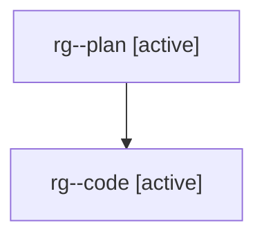

# Family: rg

[Agent Hoods](../README.md) / [bbugyi200](../users/bbugyi200/README.md) / [athena](../users/bbugyi200/machines/athena/README.md) / [rg](../users/bbugyi200/machines/athena/hoods/rg/README.md) / rg

Owner: `bbugyi200.athena` · Hood: `rg` · Members: 2

## Lineage

The diagram is an optional enhancement; the ordered table below contains the same lineage in accessible text.

| Role | Agent | State | Model / provider | Timing | Commits | Prompt | Chat |
|---|---|---|---|---|---:|---|---|
| plan | rg--plan | active | gpt-5.6-sol / codex | 2026-08-01T14:28:46.986541+00:00 | 0 | [Prompt](../agents/bbugyi200.athena.rg--plan/prompt.md) | [Chat](../agents/bbugyi200.athena.rg--plan/chat.md) |
| code | rg--code | active | gpt-5.5 / codex | 2026-08-01T14:36:30.227204+00:00 | [1](../agents/bbugyi200.athena.rg--code/README.md#commits) | — | — |

## Commits

| Role | Repo | Commit | Subject | Committed |
|---|---|---|---|---|
| code | sase | [`1c29afa`](https://github.com/sase-org/sase/commit/1c29afae277b55a4bbe584c9f73193d90ef3f1a4) | fix(agent-clis): hide internal providers from CLI management | 2026-08-01 10:53:46 EDT |
