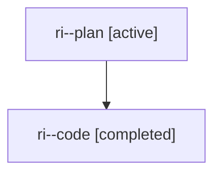

# Family: ri

[Agent Hoods](../README.md) / [bbugyi200](../users/bbugyi200/README.md) / [athena](../users/bbugyi200/machines/athena/README.md) / [ri](../users/bbugyi200/machines/athena/hoods/ri/README.md) / ri

Owner: `bbugyi200.athena` · Hood: `ri` · Members: 2

## Lineage

The diagram is an optional enhancement; the ordered table below contains the same lineage in accessible text.

| Role | Agent | State | Model / provider | Timing | Commits | Prompt | Chat |
|---|---|---|---|---|---:|---|---|
| plan | ri--plan | active | gpt-5.6-sol / codex | 2026-08-01T16:10:00.444651+00:00 | 0 | [Prompt](../agents/bbugyi200.athena.ri--plan/prompt.md) | [Chat](../agents/bbugyi200.athena.ri--plan/chat.md) |
| code | ri--code | completed | gpt-5.5 / codex | 2026-08-01T16:18:01.630681+00:00 | [1](../agents/bbugyi200.athena.ri--code/README.md#commits) | — | [Chat](../agents/bbugyi200.athena.ri--code/chat.md) |

## Commits

| Role | Repo | Commit | Subject | Committed |
|---|---|---|---|---|
| code | sase | [`d53f085`](https://github.com/sase-org/sase/commit/d53f0856eed0f83076e2afe96ad5b1fb0bee5707) | feat(ace): add undo for bulk agent read toggle | 2026-08-01 12:33:05 EDT |
