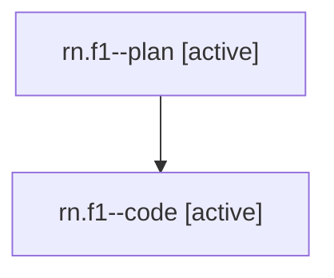

# Family: rn.f1

[Agent Hoods](../README.md) / [bbugyi200](../users/bbugyi200/README.md) / [athena](../users/bbugyi200/machines/athena/README.md) / [rn](../users/bbugyi200/machines/athena/hoods/rn/README.md) / rn.f1

Owner: `bbugyi200.athena` · Hood: `rn` · Members: 2

## Lineage

The diagram is an optional enhancement; the ordered table below contains the same lineage in accessible text.

| Role | Agent | State | Model / provider | Timing | Commits | Prompt | Chat |
|---|---|---|---|---|---:|---|---|
| plan | rn.f1--plan | active | opus / claude | 2026-08-02T11:32:20.899367+00:00 | 0 | [Prompt](../agents/bbugyi200.athena.rn.f1--plan/prompt.md) | [Chat](../agents/bbugyi200.athena.rn.f1--plan/chat.md) |
| code | rn.f1--code | active | gpt-5.6-sol / codex | 2026-08-02T12:14:18.518138+00:00 | 0 | — | — |

## Neighbors

| Agent | Relation | State |
|---|---|---|
| [rn](bbugyi200.athena.rn.md) (family · 2) | ancestor | completed 2 |
