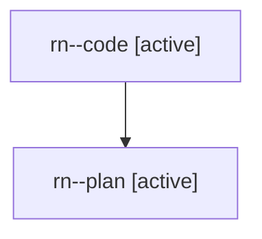

# Family: rn

[Agent Hoods](../README.md) / [bbugyi200](../users/bbugyi200/README.md) / [athena](../users/bbugyi200/machines/athena/README.md) / [rn](../users/bbugyi200/machines/athena/hoods/rn/README.md) / rn

Owner: `bbugyi200.athena` · Hood: `rn` · Members: 2

## Lineage

The diagram is an optional enhancement; the ordered table below contains the same lineage in accessible text.

| Role | Agent | State | Model / provider | Timing | Commits | Prompt | Chat |
|---|---|---|---|---|---:|---|---|
| code | rn--code | active | gpt-5.6-sol / codex | 2026-08-02T10:43:17.770106+00:00 | 0 | — | — |
| plan | rn--plan | active | opus / claude | 2026-08-02T10:30:30.666227+00:00 | 0 | [Prompt](../agents/bbugyi200.athena.rn--plan/prompt.md) | [Chat](../agents/bbugyi200.athena.rn--plan/chat.md) |

## Neighbors

| Agent | Relation | State |
|---|---|---|
| [rn.f0](../agents/bbugyi200.athena.rn.f0/README.md) | descendant | waiting |
