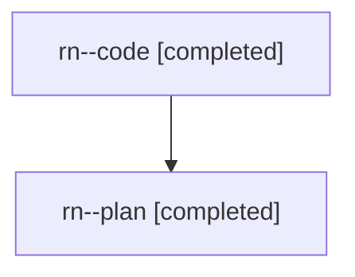

# Family: rn

[Agent Hoods](../README.md) / [bbugyi200](../users/bbugyi200/README.md) / [athena](../users/bbugyi200/machines/athena/README.md) / [rn](../users/bbugyi200/machines/athena/hoods/rn/README.md) / rn

Owner: `bbugyi200.athena` · Hood: `rn` · Members: 2

## Lineage

The diagram is an optional enhancement; the ordered table below contains the same lineage in accessible text.

| Role | Agent | State | Model / provider | Timing | Commits | Prompt | Chat |
|---|---|---|---|---|---:|---|---|
| code | rn--code | completed | gpt-5.6-sol / codex | 2026-08-02T10:43:17.770106+00:00 | [1](../agents/bbugyi200.athena.rn--code/README.md#commits) | — | [Chat](../agents/bbugyi200.athena.rn--code/chat.md) |
| plan | rn--plan | completed | opus / claude | 2026-08-02T10:30:30.666227+00:00 | 0 | [Prompt](../agents/bbugyi200.athena.rn--plan/prompt.md) | [Chat](../agents/bbugyi200.athena.rn--plan/chat.md) |

## Commits

| Role | Repo | Commit | Subject | Committed (UTC) |
|---|---|---|---|---|
| code | sase | [`6800c3d`](https://github.com/sase-org/sase/commit/6800c3d3eff788c7850d06e2619dd79d253c323c) | feat(stats): report plan and question activity from gates | 2026-08-02 11:31:12 |

## Neighbors

| Agent | Relation | State |
|---|---|---|
| [rn.f1](../agents/bbugyi200.athena.rn.f1/README.md) | descendant | active |
