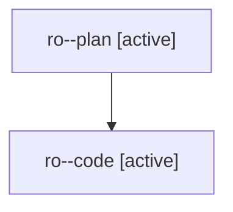

# Family: ro

[Agent Hoods](../README.md) / [bbugyi200](../users/bbugyi200/README.md) / [athena](../users/bbugyi200/machines/athena/README.md) / [ro](../users/bbugyi200/machines/athena/hoods/ro/README.md) / ro

Owner: `bbugyi200.athena` · Hood: `ro` · Members: 2

## Lineage

The diagram is an optional enhancement; the ordered table below contains the same lineage in accessible text.

| Role | Agent | State | Model / provider | Timing | Commits | Prompt | Chat |
|---|---|---|---|---|---:|---|---|
| plan | ro--plan | active | opus / claude | 2026-08-02T10:49:42.277408+00:00 | 0 | [Prompt](../agents/bbugyi200.athena.ro--plan/prompt.md) | [Chat](../agents/bbugyi200.athena.ro--plan/chat.md) |
| code | ro--code | active | gpt-5.6-sol / codex | 2026-08-02T10:59:01.935847+00:00 | 0 | — | — |
