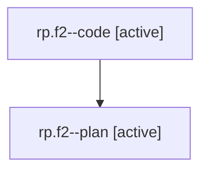

# Family: rp.f2

[Agent Hoods](../README.md) / [bbugyi200](../users/bbugyi200/README.md) / [athena](../users/bbugyi200/machines/athena/README.md) / [rp](../users/bbugyi200/machines/athena/hoods/rp/README.md) / rp.f2

Owner: `bbugyi200.athena` · Hood: `rp` · Members: 2

## Lineage

The diagram is an optional enhancement; the ordered table below contains the same lineage in accessible text.

| Role | Agent | State | Model / provider | Timing | Commits | Prompt | Chat |
|---|---|---|---|---|---:|---|---|
| code | rp.f2--code | active | gpt-5.6-sol / codex | 2026-08-02T11:41:09.787369+00:00 | 0 | — | — |
| plan | rp.f2--plan | active | gpt-5.6-sol / codex | 2026-08-02T11:31:32.840312+00:00 | 0 | [Prompt](../agents/bbugyi200.athena.rp.f2--plan/prompt.md) | [Chat](../agents/bbugyi200.athena.rp.f2--plan/chat.md) |

## Neighbors

| Agent | Relation | State |
|---|---|---|
| [rp](bbugyi200.athena.rp.md) (family · 2) | ancestor | completed 2 |
| [rp.f0](../agents/bbugyi200.athena.rp.f0/README.md) | rp hood | dismissed |
