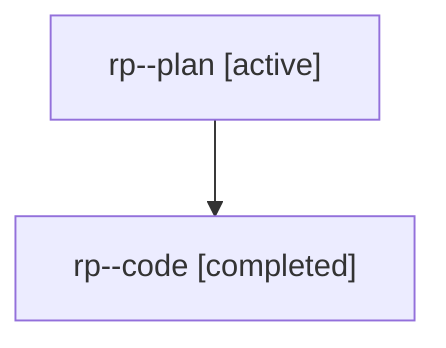

# Family: rp

[Agent Hoods](../README.md) / [bbugyi200](../users/bbugyi200/README.md) / [athena](../users/bbugyi200/machines/athena/README.md) / [rp](../users/bbugyi200/machines/athena/hoods/rp/README.md) / rp

Owner: `bbugyi200.athena` · Hood: `rp` · Members: 2

## Lineage

The diagram is an optional enhancement; the ordered table below contains the same lineage in accessible text.

| Role | Agent | State | Model / provider | Timing | Commits | Prompt | Chat |
|---|---|---|---|---|---:|---|---|
| plan | rp--plan | active | gpt-5.6-sol / codex | 2026-08-02T10:53:44.329358+00:00 | 0 | [Prompt](../agents/bbugyi200.athena.rp--plan/prompt.md) | [Chat](../agents/bbugyi200.athena.rp--plan/chat.md) |
| code | rp--code | completed | gpt-5.6-sol / codex | 2026-08-02T10:59:20.452079+00:00 | [1](../agents/bbugyi200.athena.rp--code/README.md#commits) | — | [Chat](../agents/bbugyi200.athena.rp--code/chat.md) |

## Commits

| Role | Repo | Commit | Subject | Committed |
|---|---|---|---|---|
| code | sase | [`0d7c351`](https://github.com/sase-org/sase/commit/0d7c351e43d258f67ee98c346f41ec246f1f7573) | feat(llm): default smartest alias to Opus at max effort | 2026-08-02 07:30:02 EDT |

## Neighbors

| Agent | Relation | State |
|---|---|---|
| [rp.f0](../agents/bbugyi200.athena.rp.f0/README.md) | descendant | waiting |
| [rp.f2](bbugyi200.athena.rp.f2.md) (family · 2) | descendant | active 1, completed 1 |
