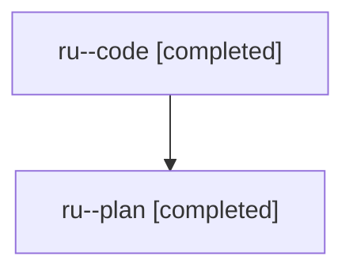

# Family: ru

[Agent Hoods](../README.md) / [bbugyi200](../users/bbugyi200/README.md) / [athena](../users/bbugyi200/machines/athena/README.md) / [ru](../users/bbugyi200/machines/athena/hoods/ru/README.md) / ru

Owner: `bbugyi200.athena` · Hood: `ru` · Members: 2

## Lineage

The diagram is an optional enhancement; the ordered table below contains the same lineage in accessible text.

| Role | Agent | State | Model / provider | Timing | Commits | Prompt | Chat |
|---|---|---|---|---|---:|---|---|
| code | ru--code | completed | sonnet / claude | 2026-08-02T13:46:05.065258+00:00 | 0 | — | [Chat](../agents/bbugyi200.athena.ru--code/chat.md) |
| plan | ru--plan | completed | opus / claude | 2026-08-02T13:17:07.627549+00:00 | 0 | [Prompt](../agents/bbugyi200.athena.ru--plan/prompt.md) | [Chat](../agents/bbugyi200.athena.ru--plan/chat.md) |
