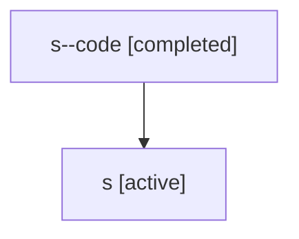

# Family: s

[Agent Hoods](../README.md) / [bbugyi200](../users/bbugyi200/README.md) / [athena](../users/bbugyi200/machines/athena/README.md) / [s](../users/bbugyi200/machines/athena/hoods/s/README.md) / s

Owner: `bbugyi200.athena` · Hood: `s` · Members: 2

## Lineage

The diagram is an optional enhancement; the ordered table below contains the same lineage in accessible text.

| Role | Agent | State | Model / provider | Timing | Commits | Prompt | Chat |
|---|---|---|---|---|---:|---|---|
| code | s--code | completed | gpt-5.5 / codex | 2026-07-06T23:14:54.262621+00:00 | [1](../agents/bbugyi200.athena.s--code/README.md#commits) | — | [Chat](../agents/bbugyi200.athena.s--code/chat.md) |
| root | s | active | claude-fable-5 / claude | 2026-07-06T23:11:00.267535+00:00 | [1](../agents/bbugyi200.athena.s/README.md#commits) | [Prompt](../agents/bbugyi200.athena.s/prompt.md) | [Chat](../agents/bbugyi200.athena.s/chat.md) |

## Commits

| Role | Repo | Commit | Subject | Committed |
|---|---|---|---|---|
| — | sase | [`c318af1`](https://github.com/sase-org/sase/commit/c318af1e724b3bfced9347f4bbb3ce1b442e7e52) | fix: Pin "local time" to the configured timezone everywhere | 2026-07-03 13:08:46 EDT |
| root | sase | [`39e2c22`](https://github.com/sase-org/sase/commit/39e2c22c2a6675470178b3d7d1a6ea814381f4f5) | chore: Add SDD prompt and plan for demo\_video\_stamp\_and\_commit | 2026-07-06 19:14:53 EDT |
| code | sase | [`7fb19c3`](https://github.com/sase-org/sase/commit/7fb19c3953cdb0988c831c7d67eb5da21ee61dc5) | build: update demo video regeneration workflow | 2026-07-06 19:25:14 EDT |

## Neighbors

| Agent | Relation | State |
|---|---|---|
| [s.w1](../agents/bbugyi200.athena.s.w1/README.md) | descendant | active |
| [s.w1.f1](../agents/bbugyi200.athena.s.w1.f1/README.md) | descendant | completed |
| [s.w1.f1.f1.f1](../agents/bbugyi200.athena.s.w1.f1.f1.f1/README.md) | descendant | completed |
| [s.w1.w1](bbugyi200.athena.s.w1.w1.md) (family · 2) | descendant | active 1, completed 1 |
