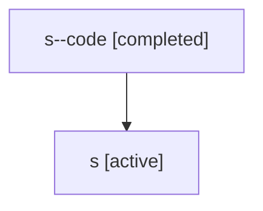

# Family: s

Owner: `bbugyi200.athena` · Hood: `s` · Members: 2

## Lineage

The diagram is an optional enhancement; the ordered table below contains the same lineage in accessible text.

| Role | Agent | State | Model / provider | Timing | Commits | Prompt | Chat |
|---|---|---|---|---|---:|---|---|
| code | s--code | completed | gpt-5.5 / codex | 2026-07-06T23:14:54.262621+00:00 | 0 | — | [Chat](../agents/bbugyi200.athena.s--code/chat.md) |
| root | s | active | claude-fable-5 / claude | 2026-07-06T23:11:00.267535+00:00 | 3 | [Prompt](../agents/bbugyi200.athena.s/prompt.md) | [Chat](../agents/bbugyi200.athena.s/chat.md) |
