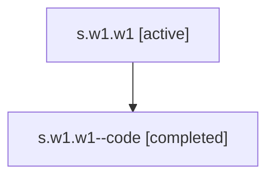

# Family: s.w1.w1

Owner: `bbugyi200.athena` · Hood: `s` · Members: 2

## Lineage

The diagram is an optional enhancement; the ordered table below contains the same lineage in accessible text.

| Role | Agent | State | Model / provider | Timing | Commits | Prompt | Chat |
|---|---|---|---|---|---:|---|---|
| root | s.w1.w1 | active | gpt-5.5 / codex | 2026-07-06T23:34:40.164275+00:00 | 2 | [Prompt](../agents/bbugyi200.athena.s.w1.w1/prompt.md) | [Chat](../agents/bbugyi200.athena.s.w1.w1/chat.md) |
| code | s.w1.w1--code | completed | gpt-5.5 / codex | 2026-07-06T23:36:14.318728+00:00 | 1 | — | [Chat](../agents/bbugyi200.athena.s.w1.w1--code/chat.md) |
