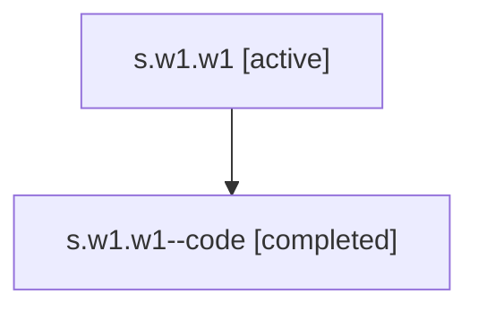

# Family: s.w1.w1

[Agent Hoods](../README.md) / [bbugyi200](../users/bbugyi200/README.md) / [athena](../users/bbugyi200/machines/athena/README.md) / [s](../users/bbugyi200/machines/athena/hoods/s/README.md) / s.w1.w1

Owner: `bbugyi200.athena` · Hood: `s` · Members: 2

## Lineage

The diagram is an optional enhancement; the ordered table below contains the same lineage in accessible text.

| Role | Agent | State | Model / provider | Timing | Commits | Prompt | Chat |
|---|---|---|---|---|---:|---|---|
| root | s.w1.w1 | active | gpt-5.5 / codex | 2026-07-06T23:34:40.164275+00:00 | [2](../agents/bbugyi200.athena.s.w1.w1/README.md#commits) | [Prompt](../agents/bbugyi200.athena.s.w1.w1/prompt.md) | [Chat](../agents/bbugyi200.athena.s.w1.w1/chat.md) |
| code | s.w1.w1--code | completed | gpt-5.5 / codex | 2026-07-06T23:36:14.318728+00:00 | [1](../agents/bbugyi200.athena.s.w1.w1--code/README.md#commits) | — | [Chat](../agents/bbugyi200.athena.s.w1.w1--code/chat.md) |

## Commits

| Role | Repo | Commit | Subject | Committed |
|---|---|---|---|---|
| root | sase | [`dcf9e74`](https://github.com/sase-org/sase/commit/dcf9e74aa8246d403c60035e0ccb7e98d808d08e) | chore: Add SDD prompt and plan for ace\_prompt\_input\_demo | 2026-07-06 23:36:09 UTC |
| code | sase | [`05dd75c`](https://github.com/sase-org/sase/commit/05dd75c013a130aa9f97d81447b165a938e33e0a) | docs(demos): expand ACE prompt input demo | 2026-07-07 00:00:58 UTC |
| root | sase | [`05dd75c`](https://github.com/sase-org/sase/commit/05dd75c013a130aa9f97d81447b165a938e33e0a) | docs(demos): expand ACE prompt input demo | 2026-07-07 00:00:58 UTC |

## Neighbors

| Agent | Relation | State |
|---|---|---|
| [s.w1](../agents/bbugyi200.athena.s.w1/README.md) | ancestor | active |
| [s](bbugyi200.athena.s.md) (family · 2) | ancestor | active 1, completed 1 |
| [s.w1.f1](../agents/bbugyi200.athena.s.w1.f1/README.md) | s.w1 hood | completed |
| [s.w1.f1.f1.f1](../agents/bbugyi200.athena.s.w1.f1.f1.f1/README.md) | s.w1 hood | completed |
