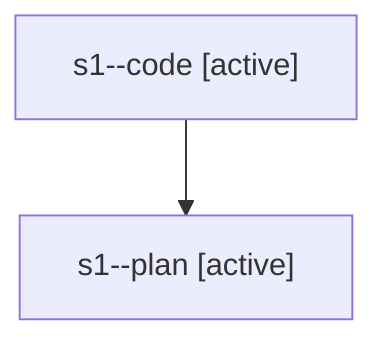

# Family: s1

[Agent Hoods](../README.md) / [bbugyi200](../users/bbugyi200/README.md) / [athena](../users/bbugyi200/machines/athena/README.md) / [s1](../users/bbugyi200/machines/athena/hoods/s1/README.md) / s1

Owner: `bbugyi200.athena` · Hood: `s1` · Members: 2

## Lineage

The diagram is an optional enhancement; the ordered table below contains the same lineage in accessible text.

| Role | Agent | State | Model / provider | Timing | Commits | Prompt | Chat |
|---|---|---|---|---|---:|---|---|
| code | s1--code | active | sonnet / claude | 2026-08-02T14:26:01.801156+00:00 | [1](../agents/bbugyi200.athena.s1--code/README.md#commits) | — | — |
| plan | s1--plan | active | opus / claude | 2026-08-02T14:14:40.679642+00:00 | 0 | [Prompt](../agents/bbugyi200.athena.s1--plan/prompt.md) | [Chat](../agents/bbugyi200.athena.s1--plan/chat.md) |

## Commits

| Role | Repo | Commit | Subject | Committed |
|---|---|---|---|---|
| code | sase | [`f393b91`](https://github.com/sase-org/sase/commit/f393b9151dc2f8151f0901628c3c47f1015d1bbd) | fix(ace-tui): restore tasks-tab selection for durable-store rows | 2026-08-02 11:00:41 EDT |
