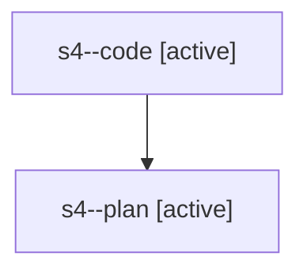

# Family: s4

[Agent Hoods](../README.md) / [bbugyi200](../users/bbugyi200/README.md) / [athena](../users/bbugyi200/machines/athena/README.md) / [s4](../users/bbugyi200/machines/athena/hoods/s4/README.md) / s4

Owner: `bbugyi200.athena` · Hood: `s4` · Members: 2

## Lineage

The diagram is an optional enhancement; the ordered table below contains the same lineage in accessible text.

| Role | Agent | State | Model / provider | Timing | Commits | Prompt | Chat |
|---|---|---|---|---|---:|---|---|
| code | s4--code | active | gpt-5.5 / codex | 2026-08-02T15:47:40.474575+00:00 | 0 | — | — |
| plan | s4--plan | active | gpt-5.6-sol / codex | 2026-08-02T15:40:13.032414+00:00 | 0 | [Prompt](../agents/bbugyi200.athena.s4--plan/prompt.md) | [Chat](../agents/bbugyi200.athena.s4--plan/chat.md) |
