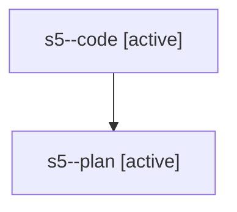

# Family: s5

[Agent Hoods](../README.md) / [bbugyi200](../users/bbugyi200/README.md) / [athena](../users/bbugyi200/machines/athena/README.md) / [s5](../users/bbugyi200/machines/athena/hoods/s5/README.md) / s5

Owner: `bbugyi200.athena` · Hood: `s5` · Members: 2

## Lineage

The diagram is an optional enhancement; the ordered table below contains the same lineage in accessible text.

| Role | Agent | State | Model / provider | Timing | Commits | Prompt | Chat |
|---|---|---|---|---|---:|---|---|
| code | s5--code | active | gpt-5.5 / codex | 2026-08-02T15:58:43.346359+00:00 | 0 | — | — |
| plan | s5--plan | active | gpt-5.6-sol / codex | 2026-08-02T15:46:41.064816+00:00 | 0 | [Prompt](../agents/bbugyi200.athena.s5--plan/prompt.md) | [Chat](../agents/bbugyi200.athena.s5--plan/chat.md) |
