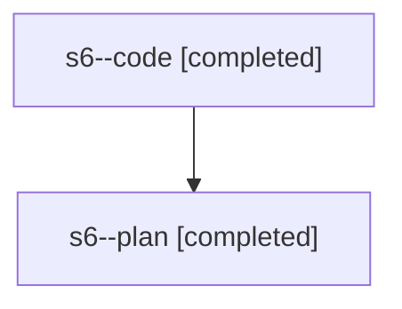

# Family: s6

[Agent Hoods](../README.md) / [bbugyi200](../users/bbugyi200/README.md) / [athena](../users/bbugyi200/machines/athena/README.md) / [s6](../users/bbugyi200/machines/athena/hoods/s6/README.md) / s6

Owner: `bbugyi200.athena` · Hood: `s6` · Members: 2

## Lineage

The diagram is an optional enhancement; the ordered table below contains the same lineage in accessible text.

| Role | Agent | State | Model / provider | Timing | Commits | Prompt | Chat |
|---|---|---|---|---|---:|---|---|
| code | s6--code | completed | gpt-5.5 / codex | 2026-08-02T15:55:50.273379+00:00 | [1](../agents/bbugyi200.athena.s6--code/README.md#commits) | — | [Chat](../agents/bbugyi200.athena.s6--code/chat.md) |
| plan | s6--plan | completed | gpt-5.6-sol / codex | 2026-08-02T15:48:33.181773+00:00 | 0 | [Prompt](../agents/bbugyi200.athena.s6--plan/prompt.md) | [Chat](../agents/bbugyi200.athena.s6--plan/chat.md) |

## Commits

| Role | Repo | Commit | Subject | Committed (UTC) |
|---|---|---|---|---|
| code | sase | [`a39ca1f`](https://github.com/sase-org/sase/commit/a39ca1f9d4cb3c5c2579ff7075dbc9a4007ab28e) | fix(llm): route claude coder default to gpt-5.5 | 2026-08-02 16:09:19 |
