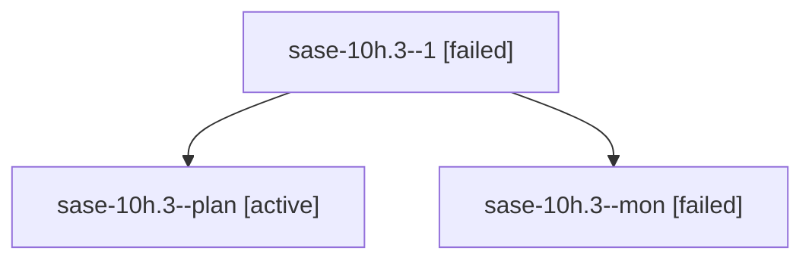

# Family: sase-10h.3

[Agent Hoods](../README.md) / [bbugyi200](../users/bbugyi200/README.md) / [athena](../users/bbugyi200/machines/athena/README.md) / [sase-10h](../users/bbugyi200/machines/athena/hoods/sase-10h/README.md) / sase-10h.3

Owner: `bbugyi200.athena` · Hood: `sase-10h` · Members: 3 · Bead: [sase-10h.3](https://github.com/sase-org/sase--beads/blob/main/pages/sase-10h/sase-10h.3.md)

## Lineage

The diagram is an optional enhancement; the ordered table below contains the same lineage in accessible text.

| Role | Agent | State | Model / provider | Timing | Commits | Prompt | Chat |
|---|---|---|---|---|---:|---|---|
| 1 | sase-10h.3--1 | failed | gpt-5.5 / codex | 20260913231046 → 2026-09-14T03:11:25.658916+00:00 | 0 | [Prompt](../agents/bbugyi200.athena.sase-10h.3--1/prompt.md) | — |
| plan | sase-10h.3--plan | active | sonnet / claude | 2026-09-14T00:03:35.143356+00:00 | 0 | [Prompt](../agents/bbugyi200.athena.sase-10h.3--plan/prompt.md) | [Chat](../agents/bbugyi200.athena.sase-10h.3--plan/chat.md) |
| mon | sase-10h.3--mon | failed | sonnet / claude | 2026-09-14T02:25:29.785198+00:00 → 2026-09-14T03:11:26.097661+00:00 | 0 | — | [Chat](../agents/bbugyi200.athena.sase-10h.3--mon/chat.md) |

## Neighbors

| Agent | Relation | State |
|---|---|---|
| [sase-10h.1](../agents/bbugyi200.athena.sase-10h.1/README.md) | sase-10h hood | active |
| [sase-10h.2](../agents/bbugyi200.athena.sase-10h.2/README.md) | sase-10h hood | active |
| [sase-10h.land](bbugyi200.athena.sase-10h.land.md) (family · 3) | sase-10h hood | active 2, completed 1 |
