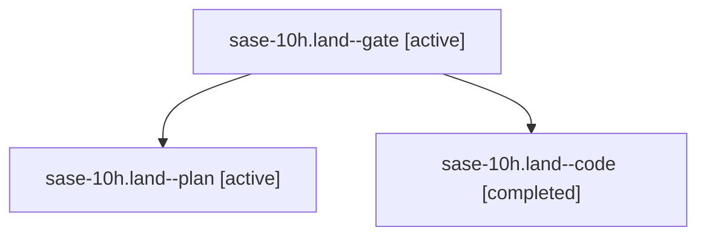

# Family: sase-10h.land

[Agent Hoods](../README.md) / [bbugyi200](../users/bbugyi200/README.md) / [athena](../users/bbugyi200/machines/athena/README.md) / [sase-10h](../users/bbugyi200/machines/athena/hoods/sase-10h/README.md) / sase-10h.land

Owner: `bbugyi200.athena` · Hood: `sase-10h` · Members: 3 · Bead: [sase-10h](https://github.com/sase-org/sase--beads/blob/main/pages/sase-10h/README.md)

## Lineage

The diagram is an optional enhancement; the ordered table below contains the same lineage in accessible text.

| Role | Agent | State | Model / provider | Timing | Commits | Prompt | Chat |
|---|---|---|---|---|---:|---|---|
| gate | sase-10h.land--gate | active | gpt-5.6-sol / codex | 2026-09-14T11:14:22.842843+00:00 | 0 | — | [Chat](../agents/bbugyi200.athena.sase-10h.land--gate/chat.md) |
| plan | sase-10h.land--plan | active | gpt-5.6-sol / codex | 2026-09-14T11:02:16.639944+00:00 | 0 | [Prompt](../agents/bbugyi200.athena.sase-10h.land--plan/prompt.md) | [Chat](../agents/bbugyi200.athena.sase-10h.land--plan/chat.md) |
| code | sase-10h.land--code | completed | sonnet / claude | 2026-09-14T11:14:55.405793+00:00 → 2026-09-14T12:03:01.813797+00:00 | [1](../agents/bbugyi200.athena.sase-10h.land--code/README.md#commits) | — | [Chat](../agents/bbugyi200.athena.sase-10h.land--code/chat.md) |

## Commits

| Role | Repo | Commit | Subject | Committed |
|---|---|---|---|---|
| code | sase | [`8bd8fb8`](https://github.com/sase-org/sase/commit/8bd8fb891dd95d776dd06a712864de23d48d4c34) | fix(monitor): preserve explicit zero queue weight through capacity and fleet projections | 2026-09-14 07:56:24 EDT |

## Neighbors

| Agent | Relation | State |
|---|---|---|
| [sase-10h.1](../agents/bbugyi200.athena.sase-10h.1/README.md) | sase-10h hood | active |
| [sase-10h.2](../agents/bbugyi200.athena.sase-10h.2/README.md) | sase-10h hood | active |
| [sase-10h.3](bbugyi200.athena.sase-10h.3.md) (family · 3) | sase-10h hood | active 1, failed 2 |
