# Family: sase-10w.5.f0.f0

[Agent Hoods](../README.md) / [bbugyi200](../users/bbugyi200/README.md) / [athena](../users/bbugyi200/machines/athena/README.md) / [sase-10w](../users/bbugyi200/machines/athena/hoods/sase-10w/README.md) / sase-10w.5.f0.f0

Owner: `bbugyi200.athena` · Hood: `sase-10w` · Members: 13

## Lineage

```mermaid
flowchart TD
  n0["sase-10w.5.f0.f0--mon-2 [failed]"]
  n1["sase-10w.5.f0.f0--code [completed]"]
  n0 --> n1
  n2["sase-10w.5.f0.f0--mon [failed]"]
  n0 --> n2
  n3["sase-10w.5.f0.f0--mon-1 [failed]"]
  n0 --> n3
  n4["sase-10w.5.f0.f0--1 [completed]"]
  n0 --> n4
  n5["sase-10w.5.f0.f0--4 [completed]"]
  n0 --> n5
  n6["sase-10w.5.f0.f0--gate [failed]"]
  n0 --> n6
  n7["sase-10w.5.f0.f0--2 [completed]"]
  n0 --> n7
  n8["sase-10w.5.f0.f0--mon-3 [failed]"]
  n0 --> n8
  n9["sase-10w.5.f0.f0--mon-0 [failed]"]
  n0 --> n9
  n10["sase-10w.5.f0.f0--3 [completed]"]
  n0 --> n10
  n11["sase-10w.5.f0.f0--5 [failed]"]
  n0 --> n11
  n12["sase-10w.5.f0.f0--plan [active]"]
  n0 --> n12
```

The diagram is an optional enhancement; the ordered table below contains the same lineage in accessible text.

| Role | Agent | State | Model / provider | Timing | Commits | Prompt | Chat |
|---|---|---|---|---|---:|---|---|
| mon-2 | sase-10w.5.f0.f0--mon-2 | failed | gpt-5.5 / codex | 2026-09-14T19:47:13.272840+00:00 → 2026-09-14T20:29:26.793282+00:00 | 0 | — | [Chat](../agents/bbugyi200.athena.sase-10w.5.f0.f0--mon-2/chat.md) |
| code | sase-10w.5.f0.f0--code | completed | gpt-5.5 / codex | 2026-09-14T18:04:32.876157+00:00 → 2026-09-14T18:09:10.299751+00:00 | 0 | [Prompt](../agents/bbugyi200.athena.sase-10w.5.f0.f0--code/prompt.md) | [Chat](../agents/bbugyi200.athena.sase-10w.5.f0.f0--code/chat.md) |
| mon | sase-10w.5.f0.f0--mon | failed | gpt-5.5 / codex | 2026-09-14T18:08:53.436596+00:00 → 2026-09-14T18:49:45.185375+00:00 | 0 | — | [Chat](../agents/bbugyi200.athena.sase-10w.5.f0.f0--mon/chat.md) |
| mon-1 | sase-10w.5.f0.f0--mon-1 | failed | gpt-5.5 / codex | 2026-09-14T19:08:31.699599+00:00 → 2026-09-14T19:35:57.406211+00:00 | 0 | — | [Chat](../agents/bbugyi200.athena.sase-10w.5.f0.f0--mon-1/chat.md) |
| 1 | sase-10w.5.f0.f0--1 | completed | gpt-5.5 / codex | 2026-09-14T18:49:44.950426+00:00 → 2026-09-14T18:59:11.243612+00:00 | 0 | [Prompt](../agents/bbugyi200.athena.sase-10w.5.f0.f0--1/prompt.md) | [Chat](../agents/bbugyi200.athena.sase-10w.5.f0.f0--1/chat.md) |
| 4 | sase-10w.5.f0.f0--4 | completed | gpt-5.5 / codex | 2026-09-14T20:29:26.899991+00:00 → 2026-09-14T20:43:59.257591+00:00 | 0 | [Prompt](../agents/bbugyi200.athena.sase-10w.5.f0.f0--4/prompt.md) | [Chat](../agents/bbugyi200.athena.sase-10w.5.f0.f0--4/chat.md) |
| gate | sase-10w.5.f0.f0--gate | failed | gpt-6-astra / codex | 2026-09-14T18:02:42.384601+00:00 → 2026-09-14T18:04:17.445122+00:00 | 0 | — | [Chat](../agents/bbugyi200.athena.sase-10w.5.f0.f0--gate/chat.md) |
| 2 | sase-10w.5.f0.f0--2 | completed | gpt-5.5 / codex | 2026-09-14T19:00:42.117281+00:00 → 2026-09-14T19:08:51.003922+00:00 | 0 | [Prompt](../agents/bbugyi200.athena.sase-10w.5.f0.f0--2/prompt.md) | [Chat](../agents/bbugyi200.athena.sase-10w.5.f0.f0--2/chat.md) |
| mon-3 | sase-10w.5.f0.f0--mon-3 | failed | gpt-5.5 / codex | 2026-09-14T20:43:09.324360+00:00 → 2026-09-14T22:39:24.515270+00:00 | 0 | — | [Chat](../agents/bbugyi200.athena.sase-10w.5.f0.f0--mon-3/chat.md) |
| mon-0 | sase-10w.5.f0.f0--mon-0 | failed | gpt-5.5 / codex | 2026-09-14T18:58:17.753312+00:00 → 2026-09-14T19:00:42.495144+00:00 | 0 | — | [Chat](../agents/bbugyi200.athena.sase-10w.5.f0.f0--mon-0/chat.md) |
| 3 | sase-10w.5.f0.f0--3 | completed | gpt-5.5 / codex | 2026-09-14T19:35:58.292879+00:00 → 2026-09-14T19:47:29.686482+00:00 | 0 | [Prompt](../agents/bbugyi200.athena.sase-10w.5.f0.f0--3/prompt.md) | [Chat](../agents/bbugyi200.athena.sase-10w.5.f0.f0--3/chat.md) |
| 5 | sase-10w.5.f0.f0--5 | failed | gpt-5.5 / codex | 2026-09-14T22:39:24.256233+00:00 → 2026-09-14T22:39:46.532401+00:00 | 0 | [Prompt](../agents/bbugyi200.athena.sase-10w.5.f0.f0--5/prompt.md) | — |
| plan | sase-10w.5.f0.f0--plan | active | gpt-6-astra / codex | 2026-09-14T17:52:57.154319+00:00 | 0 | [Prompt](../agents/bbugyi200.athena.sase-10w.5.f0.f0--plan/prompt.md) | [Chat](../agents/bbugyi200.athena.sase-10w.5.f0.f0--plan/chat.md) |

## Neighbors

| Agent | Relation | State |
|---|---|---|
| [sase-10w.5.f0](bbugyi200.athena.sase-10w.5.f0.md) (family · 7) | ancestor | active 1, completed 3, failed 3 |
| [sase-10w.5](../agents/bbugyi200.athena.sase-10w.5/README.md) | ancestor | active |
| [sase-10w.1](../agents/bbugyi200.athena.sase-10w.1/README.md) | sase-10w hood | active |
| [sase-10w.2](../agents/bbugyi200.athena.sase-10w.2/README.md) | sase-10w hood | active |
| [sase-10w.3](../agents/bbugyi200.athena.sase-10w.3/README.md) | sase-10w hood | active |
| [sase-10w.4](../agents/bbugyi200.athena.sase-10w.4/README.md) | sase-10w hood | active |
| [sase-10w.6](../agents/bbugyi200.athena.sase-10w.6/README.md) | sase-10w hood | waiting |
| [sase-10w.land](../agents/bbugyi200.athena.sase-10w.land/README.md) | sase-10w hood | active |
