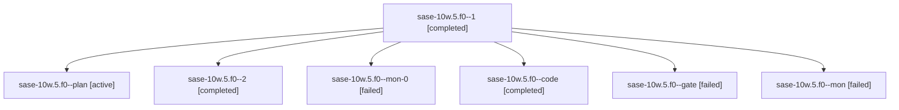

# Family: sase-10w.5.f0

[Agent Hoods](../README.md) / [bbugyi200](../users/bbugyi200/README.md) / [athena](../users/bbugyi200/machines/athena/README.md) / [sase-10w](../users/bbugyi200/machines/athena/hoods/sase-10w/README.md) / sase-10w.5.f0

Owner: `bbugyi200.athena` · Hood: `sase-10w` · Members: 7

## Lineage

The diagram is an optional enhancement; the ordered table below contains the same lineage in accessible text.

| Role | Agent | State | Model / provider | Timing | Commits | Prompt | Chat |
|---|---|---|---|---|---:|---|---|
| 1 | sase-10w.5.f0--1 | completed | gpt-5.5 / codex | 2026-09-14T16:15:28.621593+00:00 → 2026-09-14T16:34:39.769158+00:00 | 0 | [Prompt](../agents/bbugyi200.athena.sase-10w.5.f0--1/prompt.md) | [Chat](../agents/bbugyi200.athena.sase-10w.5.f0--1/chat.md) |
| plan | sase-10w.5.f0--plan | active | opus / claude | 2026-09-14T15:50:52.931455+00:00 | 0 | [Prompt](../agents/bbugyi200.athena.sase-10w.5.f0--plan/prompt.md) | [Chat](../agents/bbugyi200.athena.sase-10w.5.f0--plan/chat.md) |
| 2 | sase-10w.5.f0--2 | completed | gpt-5.5 / codex | 2026-09-14T16:48:23.487329+00:00 → 2026-09-14T16:54:11.824519+00:00 | [1](../agents/bbugyi200.athena.sase-10w.5.f0--2/README.md#commits) | [Prompt](../agents/bbugyi200.athena.sase-10w.5.f0--2/prompt.md) | [Chat](../agents/bbugyi200.athena.sase-10w.5.f0--2/chat.md) |
| mon-0 | sase-10w.5.f0--mon-0 | failed | gpt-5.5 / codex | 2026-09-14T16:33:26.533371+00:00 → 2026-09-14T16:48:23.999735+00:00 | 0 | — | [Chat](../agents/bbugyi200.athena.sase-10w.5.f0--mon-0/chat.md) |
| code | sase-10w.5.f0--code | completed | gpt-5.5 / codex | 2026-09-14T16:05:56.309329+00:00 → 2026-09-14T16:08:31.875730+00:00 | 0 | [Prompt](../agents/bbugyi200.athena.sase-10w.5.f0--code/prompt.md) | [Chat](../agents/bbugyi200.athena.sase-10w.5.f0--code/chat.md) |
| gate | sase-10w.5.f0--gate | failed | opus / claude | 2026-09-14T16:04:24.874266+00:00 → 2026-09-14T16:05:33.756237+00:00 | 0 | — | [Chat](../agents/bbugyi200.athena.sase-10w.5.f0--gate/chat.md) |
| mon | sase-10w.5.f0--mon | failed | gpt-5.5 / codex | 2026-09-14T16:08:15.446240+00:00 → 2026-09-14T16:15:28.666734+00:00 | 0 | — | [Chat](../agents/bbugyi200.athena.sase-10w.5.f0--mon/chat.md) |

## Commits

| Role | Repo | Commit | Subject | Committed |
|---|---|---|---|---|
| 2 | sase | [`df58561`](https://github.com/sase-org/sase/commit/df585611746deb530c58c30f219ebc888fbd0c53) | fix(ci): bump sase-core pin for managed tmp pressure | 2026-09-14 12:51:39 EDT |

## Neighbors

| Agent | Relation | State |
|---|---|---|
| [sase-10w.5](../agents/bbugyi200.athena.sase-10w.5/README.md) | ancestor | active |
| [sase-10w.5.f0.f0](bbugyi200.athena.sase-10w.5.f0.f0.md) (family · 13) | descendant | active 1, completed 5, failed 7 |
| [sase-10w.1](../agents/bbugyi200.athena.sase-10w.1/README.md) | sase-10w hood | active |
| [sase-10w.2](../agents/bbugyi200.athena.sase-10w.2/README.md) | sase-10w hood | active |
| [sase-10w.3](../agents/bbugyi200.athena.sase-10w.3/README.md) | sase-10w hood | active |
| [sase-10w.4](../agents/bbugyi200.athena.sase-10w.4/README.md) | sase-10w hood | active |
| [sase-10w.6](../agents/bbugyi200.athena.sase-10w.6/README.md) | sase-10w hood | waiting |
| [sase-10w.land](../agents/bbugyi200.athena.sase-10w.land/README.md) | sase-10w hood | active |
