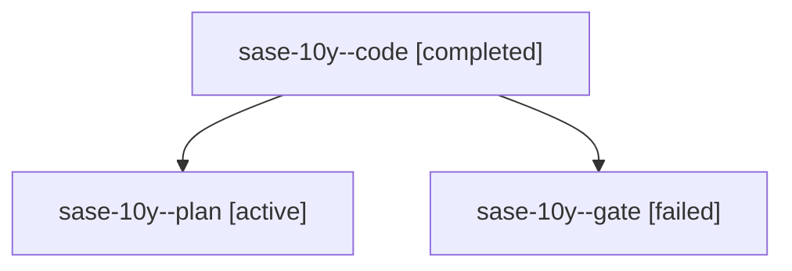

# Family: sase-10y

[Agent Hoods](../README.md) / [bbugyi200](../users/bbugyi200/README.md) / [athena](../users/bbugyi200/machines/athena/README.md) / [sase-10y](../users/bbugyi200/machines/athena/hoods/sase-10y/README.md) / sase-10y

Owner: `bbugyi200.athena` · Hood: `sase-10y` · Members: 3 · Bead: [sase-10y](https://github.com/sase-org/sase--beads/blob/main/pages/sase-10y/README.md)

## Lineage

The diagram is an optional enhancement; the ordered table below contains the same lineage in accessible text.

| Role | Agent | State | Model / provider | Timing | Commits | Prompt | Chat |
|---|---|---|---|---|---:|---|---|
| code | sase-10y--code | completed | gpt-5.5 / codex | 2026-09-18T11:20:42.901349+00:00 → 2026-09-18T12:35:58.607784+00:00 | [1](../agents/bbugyi200.athena.sase-10y--code/README.md#commits) | [Prompt](../agents/bbugyi200.athena.sase-10y--code/prompt.md) | [Chat](../agents/bbugyi200.athena.sase-10y--code/chat.md) |
| plan | sase-10y--plan | active | gpt-5.6-sol / codex | 2026-09-18T11:12:15.363018+00:00 | 0 | [Prompt](../agents/bbugyi200.athena.sase-10y--plan/prompt.md) | [Chat](../agents/bbugyi200.athena.sase-10y--plan/chat.md) |
| gate | sase-10y--gate | failed | gpt-5.6-sol / codex | 2026-09-18T11:18:07.919452+00:00 → 2026-09-18T11:20:06.494800+00:00 | 0 | — | [Chat](../agents/bbugyi200.athena.sase-10y--gate/chat.md) |

## Commits

| Role | Repo | Commit | Subject | Committed |
|---|---|---|---|---|
| code | sase | [`306802b`](https://github.com/sase-org/sase/commit/306802b33b514f9b01deb4b31e5aae120670cae1) | fix(sdd): recover dirty artifact-link clones | 2026-09-18 08:25:08 EDT |
