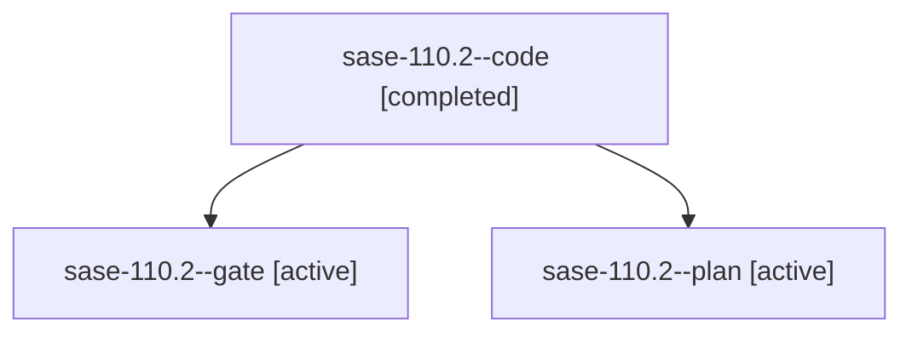

# Family: sase-110.2

[Agent Hoods](../README.md) / [bbugyi200](../users/bbugyi200/README.md) / [athena](../users/bbugyi200/machines/athena/README.md) / [sase-110](../users/bbugyi200/machines/athena/hoods/sase-110/README.md) / sase-110.2

Owner: `bbugyi200.athena` · Hood: `sase-110` · Members: 3 · Bead: [sase-110.2](https://github.com/sase-org/sase--beads/blob/main/pages/sase-110/sase-110.2.md)

## Lineage

The diagram is an optional enhancement; the ordered table below contains the same lineage in accessible text.

| Role | Agent | State | Model / provider | Timing | Commits | Prompt | Chat |
|---|---|---|---|---|---:|---|---|
| code | sase-110.2--code | completed | gpt-5.5 / codex | 2026-09-14T15:43:49.740756+00:00 → 2026-09-14T16:44:07.374911+00:00 | [1](../agents/bbugyi200.athena.sase-110.2--code/README.md#commits) | — | [Chat](../agents/bbugyi200.athena.sase-110.2--code/chat.md) |
| gate | sase-110.2--gate | active | gpt-5.6-sol / codex | 2026-09-14T15:42:56.479715+00:00 | 0 | — | [Chat](../agents/bbugyi200.athena.sase-110.2--gate/chat.md) |
| plan | sase-110.2--plan | active | gpt-5.6-sol / codex | 2026-09-14T15:35:18.870354+00:00 | 0 | [Prompt](../agents/bbugyi200.athena.sase-110.2--plan/prompt.md) | [Chat](../agents/bbugyi200.athena.sase-110.2--plan/chat.md) |

## Commits

| Role | Repo | Commit | Subject | Committed |
|---|---|---|---|---|
| code | sase | [`7b85eb6`](https://github.com/sase-org/sase/commit/7b85eb6c11ed1b098c06f372d62609ca55fae3e4) | feat(sudo): add typed sudo gate workflow | 2026-09-14 12:40:05 EDT |

## Neighbors

| Agent | Relation | State |
|---|---|---|
| [sase-110.1](bbugyi200.athena.sase-110.1.md) (family · 3) | sase-110 hood | active 2, completed 1 |
| [sase-110.3](../agents/bbugyi200.athena.sase-110.3/README.md) | sase-110 hood | active |
| [sase-110.4](bbugyi200.athena.sase-110.4.md) (family · 3) | sase-110 hood | active 2, completed 1 |
| [sase-110.5](../agents/bbugyi200.athena.sase-110.5/README.md) | sase-110 hood | active |
| [sase-110.6](bbugyi200.athena.sase-110.6.md) (family · 3) | sase-110 hood | active 2, completed 1 |
| [sase-110.7](bbugyi200.athena.sase-110.7.md) (family · 2) | sase-110 hood | active 2 |
| [sase-110.8](../agents/bbugyi200.athena.sase-110.8/README.md) | sase-110 hood | waiting |
| [sase-110.land](../agents/bbugyi200.athena.sase-110.land/README.md) | sase-110 hood | waiting |
