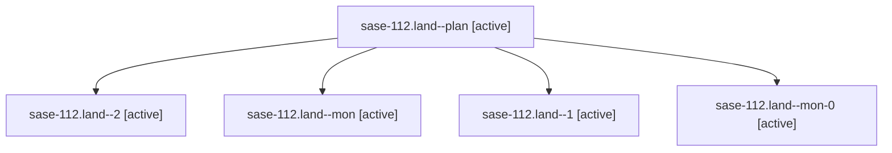

# Family: sase-112.land

[Agent Hoods](../README.md) / [bbugyi200](../users/bbugyi200/README.md) / [athena](../users/bbugyi200/machines/athena/README.md) / [sase-112](../users/bbugyi200/machines/athena/hoods/sase-112/README.md) / sase-112.land

Owner: `bbugyi200.athena` · Hood: `sase-112` · Members: 5 · Bead: [sase-112](https://github.com/sase-org/sase--beads/blob/main/pages/sase-112/README.md)

## Lineage

The diagram is an optional enhancement; the ordered table below contains the same lineage in accessible text.

| Role | Agent | State | Model / provider | Timing | Commits | Prompt | Chat |
|---|---|---|---|---|---:|---|---|
| plan | sase-112.land--plan | active | gpt-5.6-sol / codex | 2026-09-14T19:16:48.589652+00:00 | 0 | [Prompt](../agents/bbugyi200.athena.sase-112.land--plan/prompt.md) | [Chat](../agents/bbugyi200.athena.sase-112.land--plan/chat.md) |
| 2 | sase-112.land--2 | active | gpt-5.6-sol / codex | 2026-09-14T20:48:43.825086+00:00 | 0 | [Prompt](../agents/bbugyi200.athena.sase-112.land--2/prompt.md) | [Chat](../agents/bbugyi200.athena.sase-112.land--2/chat.md) |
| mon | sase-112.land--mon | active | gpt-5.6-sol / codex | 2026-09-14T19:22:11.919715+00:00 | 0 | — | [Chat](../agents/bbugyi200.athena.sase-112.land--mon/chat.md) |
| 1 | sase-112.land--1 | active | gpt-5.6-sol / codex | 2026-09-14T19:58:27.500339+00:00 | 0 | [Prompt](../agents/bbugyi200.athena.sase-112.land--1/prompt.md) | [Chat](../agents/bbugyi200.athena.sase-112.land--1/chat.md) |
| mon-0 | sase-112.land--mon-0 | active | gpt-5.6-sol / codex | 2026-09-14T20:01:49.407555+00:00 | 0 | — | [Chat](../agents/bbugyi200.athena.sase-112.land--mon-0/chat.md) |

## Neighbors

| Agent | Relation | State |
|---|---|---|
| [sase-112.1](../agents/bbugyi200.athena.sase-112.1/README.md) | sase-112 hood | active |
| [sase-112.2](../agents/bbugyi200.athena.sase-112.2/README.md) | sase-112 hood | active |
| [sase-112.3](../agents/bbugyi200.athena.sase-112.3/README.md) | sase-112 hood | active |
