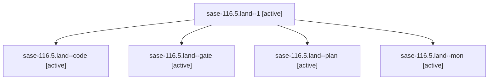

# Family: sase-116.5.land

[Agent Hoods](../README.md) / [bbugyi200](../users/bbugyi200/README.md) / [athena](../users/bbugyi200/machines/athena/README.md) / [sase-116](../users/bbugyi200/machines/athena/hoods/sase-116/README.md) / sase-116.5.land

Owner: `bbugyi200.athena` · Hood: `sase-116` · Members: 5 · Bead: [sase-116.5](https://github.com/sase-org/sase--beads/blob/main/pages/sase-116/sase-116.5.md)

## Lineage

The diagram is an optional enhancement; the ordered table below contains the same lineage in accessible text.

| Role | Agent | State | Model / provider | Timing | Commits | Prompt | Chat |
|---|---|---|---|---|---:|---|---|
| 1 | sase-116.5.land--1 | active | gpt-5.6-sol / codex | 2026-09-15T19:58:44.434470+00:00 | 0 | [Prompt](../agents/bbugyi200.athena.sase-116.5.land--1/prompt.md) | [Chat](../agents/bbugyi200.athena.sase-116.5.land--1/chat.md) |
| code | sase-116.5.land--code | active | gpt-5.5 / codex | 2026-09-15T20:06:55.046558+00:00 | [1](../agents/bbugyi200.athena.sase-116.5.land--code/README.md#commits) | [Prompt](../agents/bbugyi200.athena.sase-116.5.land--code/prompt.md) | [Chat](../agents/bbugyi200.athena.sase-116.5.land--code/chat.md) |
| gate | sase-116.5.land--gate | active | gpt-5.6-sol / codex | 2026-09-15T20:05:44.753579+00:00 | 0 | — | [Chat](../agents/bbugyi200.athena.sase-116.5.land--gate/chat.md) |
| plan | sase-116.5.land--plan | active | gpt-5.6-sol / codex | 2026-09-15T19:23:16.421877+00:00 | 0 | [Prompt](../agents/bbugyi200.athena.sase-116.5.land--plan/prompt.md) | [Chat](../agents/bbugyi200.athena.sase-116.5.land--plan/chat.md) |
| mon | sase-116.5.land--mon | active | gpt-5.6-sol / codex | 2026-09-15T19:28:54.469959+00:00 | 0 | — | [Chat](../agents/bbugyi200.athena.sase-116.5.land--mon/chat.md) |

## Commits

| Role | Repo | Commit | Subject | Committed |
|---|---|---|---|---|
| code | sase | [`981004d`](https://github.com/sase-org/sase/commit/981004d5e3efe37590d97cdad45e247029d07ac2) | test(bead): patch claimed show read view fixture | 2026-09-15 16:33:20 EDT |

## Neighbors

| Agent | Relation | State |
|---|---|---|
| [sase-116.5.1](../agents/bbugyi200.athena.sase-116.5.1/README.md) | sase-116.5 hood | active |
| [sase-116.5.2](../agents/bbugyi200.athena.sase-116.5.2/README.md) | sase-116.5 hood | active |
| [sase-116.1](../agents/bbugyi200.athena.sase-116.1/README.md) | sase-116 hood | active |
| [sase-116.2](../agents/bbugyi200.athena.sase-116.2/README.md) | sase-116 hood | active |
| [sase-116.3](../agents/bbugyi200.athena.sase-116.3/README.md) | sase-116 hood | active |
| [sase-116.4](../agents/bbugyi200.athena.sase-116.4/README.md) | sase-116 hood | active |
| [sase-116.land](bbugyi200.athena.sase-116.land.md) (family · 3) | sase-116 hood | active 3 |
