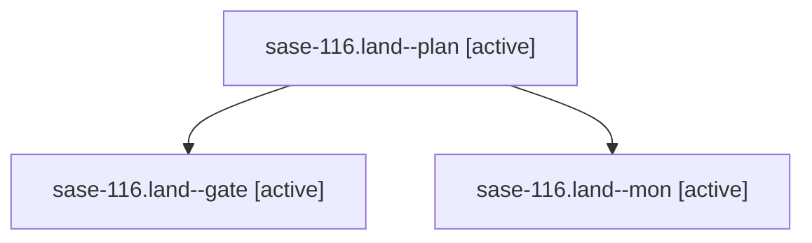

# Family: sase-116.land

[Agent Hoods](../README.md) / [bbugyi200](../users/bbugyi200/README.md) / [athena](../users/bbugyi200/machines/athena/README.md) / [sase-116](../users/bbugyi200/machines/athena/hoods/sase-116/README.md) / sase-116.land

Owner: `bbugyi200.athena` · Hood: `sase-116` · Members: 3 · Bead: [sase-116](https://github.com/sase-org/sase--beads/blob/main/pages/sase-116/README.md)

## Lineage

The diagram is an optional enhancement; the ordered table below contains the same lineage in accessible text.

| Role | Agent | State | Model / provider | Timing | Commits | Prompt | Chat |
|---|---|---|---|---|---:|---|---|
| plan | sase-116.land--plan | active | gpt-5.6-sol / codex | 2026-09-15T17:36:14.180930+00:00 | 0 | [Prompt](../agents/bbugyi200.athena.sase-116.land--plan/prompt.md) | [Chat](../agents/bbugyi200.athena.sase-116.land--plan/chat.md) |
| gate | sase-116.land--gate | active | gpt-5.6-sol / codex | 2026-09-15T17:51:10.801819+00:00 | 0 | — | [Chat](../agents/bbugyi200.athena.sase-116.land--gate/chat.md) |
| mon | sase-116.land--mon | active | gpt-5.6-sol / codex | 2026-09-15T17:51:49.994023+00:00 | 0 | — | [Chat](../agents/bbugyi200.athena.sase-116.land--mon/chat.md) |

## Neighbors

| Agent | Relation | State |
|---|---|---|
| [sase-116.1](../agents/bbugyi200.athena.sase-116.1/README.md) | sase-116 hood | active |
| [sase-116.2](../agents/bbugyi200.athena.sase-116.2/README.md) | sase-116 hood | active |
| [sase-116.3](../agents/bbugyi200.athena.sase-116.3/README.md) | sase-116 hood | active |
| [sase-116.4](../agents/bbugyi200.athena.sase-116.4/README.md) | sase-116 hood | active |
| [sase-116.5.1](../agents/bbugyi200.athena.sase-116.5.1/README.md) | sase-116 hood | active |
| [sase-116.5.2](../agents/bbugyi200.athena.sase-116.5.2/README.md) | sase-116 hood | active |
| [sase-116.5.land](bbugyi200.athena.sase-116.5.land.md) (family · 5) | sase-116 hood | active 5 |
