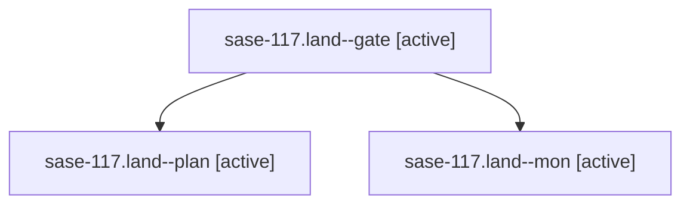

# Family: sase-117.land

[Agent Hoods](../README.md) / [bbugyi200](../users/bbugyi200/README.md) / [athena](../users/bbugyi200/machines/athena/README.md) / [sase-117](../users/bbugyi200/machines/athena/hoods/sase-117/README.md) / sase-117.land

Owner: `bbugyi200.athena` · Hood: `sase-117` · Members: 3 · Bead: [sase-117](https://github.com/sase-org/sase--beads/blob/main/pages/sase-117/README.md)

## Lineage

The diagram is an optional enhancement; the ordered table below contains the same lineage in accessible text.

| Role | Agent | State | Model / provider | Timing | Commits | Prompt | Chat |
|---|---|---|---|---|---:|---|---|
| gate | sase-117.land--gate | active | gpt-5.6-sol / codex | 2026-09-15T17:08:34.826293+00:00 | 0 | — | [Chat](../agents/bbugyi200.athena.sase-117.land--gate/chat.md) |
| plan | sase-117.land--plan | active | gpt-5.6-sol / codex | 2026-09-15T16:56:57.751717+00:00 | 0 | [Prompt](../agents/bbugyi200.athena.sase-117.land--plan/prompt.md) | [Chat](../agents/bbugyi200.athena.sase-117.land--plan/chat.md) |
| mon | sase-117.land--mon | active | gpt-5.6-sol / codex | 2026-09-15T17:09:29.672006+00:00 | 0 | — | [Chat](../agents/bbugyi200.athena.sase-117.land--mon/chat.md) |

## Neighbors

| Agent | Relation | State |
|---|---|---|
| [sase-117.1](../agents/bbugyi200.athena.sase-117.1/README.md) | sase-117 hood | active |
| [sase-117.2](../agents/bbugyi200.athena.sase-117.2/README.md) | sase-117 hood | active |
| [sase-117.3](../agents/bbugyi200.athena.sase-117.3/README.md) | sase-117 hood | active |
| [sase-117.4](../agents/bbugyi200.athena.sase-117.4/README.md) | sase-117 hood | active |
| [sase-117.5.1](../agents/bbugyi200.athena.sase-117.5.1/README.md) | sase-117 hood | active |
| [sase-117.5.2](../agents/bbugyi200.athena.sase-117.5.2/README.md) | sase-117 hood | active |
| [sase-117.5.land](bbugyi200.athena.sase-117.5.land.md) (family · 3) | sase-117 hood | active 2, completed 1 |
