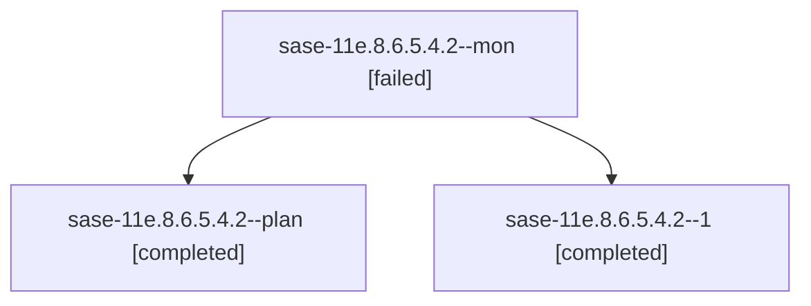

# Family: sase-11e.8.6.5.4.2

[Agent Hoods](../README.md) / [bbugyi200](../users/bbugyi200/README.md) / [athena](../users/bbugyi200/machines/athena/README.md) / [sase-11e](../users/bbugyi200/machines/athena/hoods/sase-11e/README.md) / sase-11e.8.6.5.4.2

Owner: `bbugyi200.athena` · Hood: `sase-11e` · Members: 3 · Bead: [sase-11e.8.6.5.4.2](https://github.com/sase-org/sase--beads/blob/main/pages/sase-11e/sase-11e.8.6.5.4.2.md)

## Lineage

The diagram is an optional enhancement; the ordered table below contains the same lineage in accessible text.

| Role | Agent | State | Model / provider | Timing | Commits | Prompt | Chat |
|---|---|---|---|---|---:|---|---|
| mon | sase-11e.8.6.5.4.2--mon | failed | sonnet / claude | 2026-09-16T20:02:30.313468+00:00 → 2026-09-16T20:38:46.704839+00:00 | 0 | — | [Chat](../agents/bbugyi200.athena.sase-11e.8.6.5.4.2--mon/chat.md) |
| plan | sase-11e.8.6.5.4.2--plan | completed | sonnet / claude | 2026-09-16T19:15:52.877518+00:00 → 2026-09-16T20:03:30.345738+00:00 | 0 | [Prompt](../agents/bbugyi200.athena.sase-11e.8.6.5.4.2--plan/prompt.md) | [Chat](../agents/bbugyi200.athena.sase-11e.8.6.5.4.2--plan/chat.md) |
| 1 | sase-11e.8.6.5.4.2--1 | completed | sonnet / claude | 2026-09-16T20:39:48.043626+00:00 → 2026-09-16T20:49:10.041184+00:00 | [1](../agents/bbugyi200.athena.sase-11e.8.6.5.4.2--1/README.md#commits) | [Prompt](../agents/bbugyi200.athena.sase-11e.8.6.5.4.2--1/prompt.md) | [Chat](../agents/bbugyi200.athena.sase-11e.8.6.5.4.2--1/chat.md) |

## Commits

| Role | Repo | Commit | Subject | Committed |
|---|---|---|---|---|
| 1 | sase | [`bb839b4`](https://github.com/sase-org/sase/commit/bb839b4ea8843997145e5595d48f9a519745c0f8) | fix(tribe): share one stored-tribe evidence source across wait, fork, and display | 2026-09-16 16:45:12 EDT |

## Neighbors

| Agent | Relation | State |
|---|---|---|
| [sase-11e.8.6.5.4.1](../agents/bbugyi200.athena.sase-11e.8.6.5.4.1/README.md) | sase-11e.8.6.5.4 hood | active |
| [sase-11e.8.6.5.4.3](../agents/bbugyi200.athena.sase-11e.8.6.5.4.3/README.md) | sase-11e.8.6.5.4 hood | active |
| [sase-11e.8.6.5.4.4](../agents/bbugyi200.athena.sase-11e.8.6.5.4.4/README.md) | sase-11e.8.6.5.4 hood | completed |
| [sase-11e.8.6.5.4.5](../agents/bbugyi200.athena.sase-11e.8.6.5.4.5/README.md) | sase-11e.8.6.5.4 hood | waiting |
| [sase-11e.8.6.5.4.land](../agents/bbugyi200.athena.sase-11e.8.6.5.4.land/README.md) | sase-11e.8.6.5.4 hood | waiting |
| [sase-11e.8.6.5.1](../agents/bbugyi200.athena.sase-11e.8.6.5.1/README.md) | sase-11e.8.6.5 hood | completed |
| [sase-11e.8.6.5.2](../agents/bbugyi200.athena.sase-11e.8.6.5.2/README.md) | sase-11e.8.6.5 hood | completed |
| [sase-11e.8.6.5.3](../agents/bbugyi200.athena.sase-11e.8.6.5.3/README.md) | sase-11e.8.6.5 hood | completed |
| [sase-11e.8.6.5.land](bbugyi200.athena.sase-11e.8.6.5.land.md) (family · 3) | sase-11e.8.6.5 hood | failed 3 |
| [sase-11e.8.6.1](../agents/bbugyi200.athena.sase-11e.8.6.1/README.md) | sase-11e.8.6 hood | active |
| [sase-11e.8.6.2](../agents/bbugyi200.athena.sase-11e.8.6.2/README.md) | sase-11e.8.6 hood | active |
| [sase-11e.8.6.3](../agents/bbugyi200.athena.sase-11e.8.6.3/README.md) | sase-11e.8.6 hood | active |
| [sase-11e.8.6.4](../agents/bbugyi200.athena.sase-11e.8.6.4/README.md) | sase-11e.8.6 hood | active |
| [sase-11e.8.6.land](bbugyi200.athena.sase-11e.8.6.land.md) (family · 3) | sase-11e.8.6 hood | active 3 |
| [sase-11e.8.1](../agents/bbugyi200.athena.sase-11e.8.1/README.md) | sase-11e.8 hood | active |
| [sase-11e.8.2](../agents/bbugyi200.athena.sase-11e.8.2/README.md) | sase-11e.8 hood | active |
| [sase-11e.8.3](../agents/bbugyi200.athena.sase-11e.8.3/README.md) | sase-11e.8 hood | active |
| [sase-11e.8.4](../agents/bbugyi200.athena.sase-11e.8.4/README.md) | sase-11e.8 hood | active |
| [sase-11e.8.5](bbugyi200.athena.sase-11e.8.5.md) (family · 3) | sase-11e.8 hood | active 3 |
| [sase-11e.8.land](bbugyi200.athena.sase-11e.8.land.md) (family · 3) | sase-11e.8 hood | active 3 |
| [sase-11e.1](../agents/bbugyi200.athena.sase-11e.1/README.md) | sase-11e hood | active |
| [sase-11e.2](../agents/bbugyi200.athena.sase-11e.2/README.md) | sase-11e hood | active |
| [sase-11e.3](../agents/bbugyi200.athena.sase-11e.3/README.md) | sase-11e hood | active |
| [sase-11e.4](../agents/bbugyi200.athena.sase-11e.4/README.md) | sase-11e hood | active |
| [sase-11e.5](../agents/bbugyi200.athena.sase-11e.5/README.md) | sase-11e hood | active |
| [sase-11e.6](../agents/bbugyi200.athena.sase-11e.6/README.md) | sase-11e hood | active |
| [sase-11e.7](../agents/bbugyi200.athena.sase-11e.7/README.md) | sase-11e hood | active |
| [sase-11e.land](bbugyi200.athena.sase-11e.land.md) (family · 3) | sase-11e hood | active 3 |
