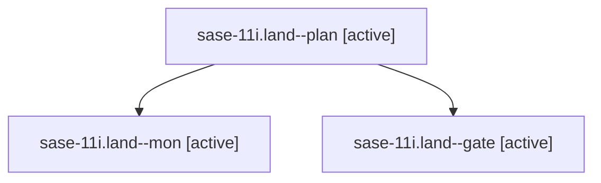

# Family: sase-11i.land

[Agent Hoods](../README.md) / [bbugyi200](../users/bbugyi200/README.md) / [athena](../users/bbugyi200/machines/athena/README.md) / [sase-11i](../users/bbugyi200/machines/athena/hoods/sase-11i/README.md) / sase-11i.land

Owner: `bbugyi200.athena` · Hood: `sase-11i` · Members: 3 · Bead: [sase-11i](https://github.com/sase-org/sase--beads/blob/main/pages/sase-11i/README.md)

## Lineage

The diagram is an optional enhancement; the ordered table below contains the same lineage in accessible text.

| Role | Agent | State | Model / provider | Timing | Commits | Prompt | Chat |
|---|---|---|---|---|---:|---|---|
| plan | sase-11i.land--plan | active | gpt-6-astra / codex | 2026-09-16T04:22:10.741658+00:00 | 0 | [Prompt](../agents/bbugyi200.athena.sase-11i.land--plan/prompt.md) | [Chat](../agents/bbugyi200.athena.sase-11i.land--plan/chat.md) |
| mon | sase-11i.land--mon | active | gpt-6-astra / codex | 2026-09-16T04:36:06.738076+00:00 | 0 | — | [Chat](../agents/bbugyi200.athena.sase-11i.land--mon/chat.md) |
| gate | sase-11i.land--gate | active | gpt-6-astra / codex | 2026-09-16T04:35:22.155877+00:00 | 0 | — | [Chat](../agents/bbugyi200.athena.sase-11i.land--gate/chat.md) |

## Neighbors

| Agent | Relation | State |
|---|---|---|
| [sase-11i.1](../agents/bbugyi200.athena.sase-11i.1/README.md) | sase-11i hood | active |
| [sase-11i.2](../agents/bbugyi200.athena.sase-11i.2/README.md) | sase-11i hood | active |
| [sase-11i.3](../agents/bbugyi200.athena.sase-11i.3/README.md) | sase-11i hood | active |
| [sase-11i.4](../agents/bbugyi200.athena.sase-11i.4/README.md) | sase-11i hood | active |
| [sase-11i.5](../agents/bbugyi200.athena.sase-11i.5/README.md) | sase-11i hood | active |
| [sase-11i.6.1](../agents/bbugyi200.athena.sase-11i.6.1/README.md) | sase-11i hood | active |
| [sase-11i.6.2](../agents/bbugyi200.athena.sase-11i.6.2/README.md) | sase-11i hood | active |
| [sase-11i.6.3](../agents/bbugyi200.athena.sase-11i.6.3/README.md) | sase-11i hood | active |
| [sase-11i.6.4](../agents/bbugyi200.athena.sase-11i.6.4/README.md) | sase-11i hood | active |
| [sase-11i.6.land](../agents/bbugyi200.athena.sase-11i.6.land/README.md) | sase-11i hood | active |
