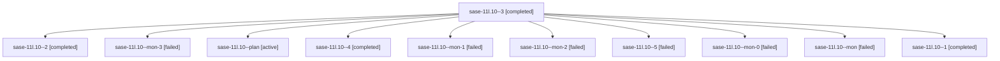

# Family: sase-11l.10

[Agent Hoods](../README.md) / [bbugyi200](../users/bbugyi200/README.md) / [athena](../users/bbugyi200/machines/athena/README.md) / [sase-11l](../users/bbugyi200/machines/athena/hoods/sase-11l/README.md) / sase-11l.10

Owner: `bbugyi200.athena` · Hood: `sase-11l` · Members: 11 · Bead: [sase-11l.10](https://github.com/sase-org/sase--beads/blob/main/pages/sase-11l/sase-11l.10.md)

## Lineage

The diagram is an optional enhancement; the ordered table below contains the same lineage in accessible text.

| Role | Agent | State | Model / provider | Timing | Commits | Prompt | Chat |
|---|---|---|---|---|---:|---|---|
| 3 | sase-11l.10--3 | completed | grok-4.6 / grok | 2026-09-18T17:31:34.809711+00:00 → 2026-09-18T17:39:59.002734+00:00 | 0 | [Prompt](../agents/bbugyi200.athena.sase-11l.10--3/prompt.md) | [Chat](../agents/bbugyi200.athena.sase-11l.10--3/chat.md) |
| 2 | sase-11l.10--2 | completed | grok-4.6 / grok | 2026-09-18T17:17:53.440890+00:00 → 2026-09-18T17:25:26.453076+00:00 | 0 | [Prompt](../agents/bbugyi200.athena.sase-11l.10--2/prompt.md) | [Chat](../agents/bbugyi200.athena.sase-11l.10--2/chat.md) |
| mon-3 | sase-11l.10--mon-3 | failed | grok-4.6 / grok | 2026-09-18T18:15:18.643522+00:00 → 2026-09-18T18:46:28.925977+00:00 | 0 | — | [Chat](../agents/bbugyi200.athena.sase-11l.10--mon-3/chat.md) |
| plan | sase-11l.10--plan | active | gpt-5.5 / codex | 2026-09-18T14:12:49.469962+00:00 | 0 | [Prompt](../agents/bbugyi200.athena.sase-11l.10--plan/prompt.md) | [Chat](../agents/bbugyi200.athena.sase-11l.10--plan/chat.md) |
| 4 | sase-11l.10--4 | completed | grok-4.6 / grok | 2026-09-18T18:09:00.781596+00:00 → 2026-09-18T18:15:53.706421+00:00 | 0 | [Prompt](../agents/bbugyi200.athena.sase-11l.10--4/prompt.md) | [Chat](../agents/bbugyi200.athena.sase-11l.10--4/chat.md) |
| mon-1 | sase-11l.10--mon-1 | failed | grok-4.6 / grok | 2026-09-18T17:24:49.778420+00:00 → 2026-09-18T17:30:32.564903+00:00 | 0 | — | [Chat](../agents/bbugyi200.athena.sase-11l.10--mon-1/chat.md) |
| mon-2 | sase-11l.10--mon-2 | failed | grok-4.6 / grok | 2026-09-18T17:39:26.341854+00:00 → 2026-09-18T18:08:54.845703+00:00 | 0 | — | [Chat](../agents/bbugyi200.athena.sase-11l.10--mon-2/chat.md) |
| 5 | sase-11l.10--5 | failed | grok-4.6 / grok | 2026-09-18T18:46:32.407738+00:00 → 2026-09-18T20:26:19.118442+00:00 | [1](../agents/bbugyi200.athena.sase-11l.10--5/README.md#commits) | [Prompt](../agents/bbugyi200.athena.sase-11l.10--5/prompt.md) | — |
| mon-0 | sase-11l.10--mon-0 | failed | gpt-5.5 / codex | 2026-09-18T16:46:23.770395+00:00 → 2026-09-18T17:17:37.913290+00:00 | 0 | — | [Chat](../agents/bbugyi200.athena.sase-11l.10--mon-0/chat.md) |
| mon | sase-11l.10--mon | failed | gpt-5.5 / codex | 2026-09-18T14:39:18.090499+00:00 → 2026-09-18T16:41:03.664236+00:00 | 0 | — | [Chat](../agents/bbugyi200.athena.sase-11l.10--mon/chat.md) |
| 1 | sase-11l.10--1 | completed | gpt-5.5 / codex | 2026-09-18T16:41:16.113827+00:00 → 2026-09-18T16:47:01.059106+00:00 | 0 | [Prompt](../agents/bbugyi200.athena.sase-11l.10--1/prompt.md) | [Chat](../agents/bbugyi200.athena.sase-11l.10--1/chat.md) |

## Commits

| Role | Repo | Commit | Subject | Committed |
|---|---|---|---|---|
| 5 | sase | [`932e6ff`](https://github.com/sase-org/sase/commit/932e6ffae232e38ecd0f72b3ee18bed3e0f6bf24) | feat(hold): make %hold unconditional and retire agent\_holds | 2026-09-18 16:24:14 EDT |

## Neighbors

| Agent | Relation | State |
|---|---|---|
| [sase-11l.1](bbugyi200.athena.sase-11l.1.md) (family · 3) | sase-11l hood | active 2, completed 1 |
| [sase-11l.11.1](bbugyi200.athena.sase-11l.11.1.md) (family · 7) | sase-11l hood | active 7 |
| [sase-11l.11.2](bbugyi200.athena.sase-11l.11.2.md) (family · 5) | sase-11l hood | active 5 |
| [sase-11l.11.3](bbugyi200.athena.sase-11l.11.3.md) (family · 3) | sase-11l hood | active 3 |
| [sase-11l.11.4](bbugyi200.athena.sase-11l.11.4.md) (family · 5) | sase-11l hood | active 5 |
| [sase-11l.11.5.1](bbugyi200.athena.sase-11l.11.5.1.md) (family · 7) | sase-11l hood | active 7 |
| [sase-11l.11.5.land](bbugyi200.athena.sase-11l.11.5.land.md) (family · 3) | sase-11l hood | active 3 |
| [sase-11l.11.5.land.f0](bbugyi200.athena.sase-11l.11.5.land.f0.md) (family · 3) | sase-11l hood | active 1, completed 1, failed 1 |
| [sase-11l.11.land](bbugyi200.athena.sase-11l.11.land.md) (family · 3) | sase-11l hood | active 3 |
| [sase-11l.2](../agents/bbugyi200.athena.sase-11l.2/README.md) | sase-11l hood | active |
| [sase-11l.3](bbugyi200.athena.sase-11l.3.md) (family · 3) | sase-11l hood | active 2, completed 1 |
| [sase-11l.4](bbugyi200.athena.sase-11l.4.md) (family · 3) | sase-11l hood | active 2, completed 1 |
| [sase-11l.5](bbugyi200.athena.sase-11l.5.md) (family · 3) | sase-11l hood | active 3 |
| [sase-11l.5](../agents/bbugyi200.athena.sase-11l.5/README.md) | sase-11l hood | dismissed |
| [sase-11l.5.1.1](bbugyi200.athena.sase-11l.5.1.1.md) (family · 3) | sase-11l hood | active 2, completed 1 |
| [sase-11l.5.1.2](bbugyi200.athena.sase-11l.5.1.2.md) (family · 3) | sase-11l hood | active 3 |
| [sase-11l.5.1.2.1.1](../agents/bbugyi200.athena.sase-11l.5.1.2.1.1/README.md) | sase-11l hood | active |
| [sase-11l.5.1.2.1.2](../agents/bbugyi200.athena.sase-11l.5.1.2.1.2/README.md) | sase-11l hood | active |
| [sase-11l.5.1.2.1.3](../agents/bbugyi200.athena.sase-11l.5.1.2.1.3/README.md) | sase-11l hood | active |
| [sase-11l.5.1.2.1.4](../agents/bbugyi200.athena.sase-11l.5.1.2.1.4/README.md) | sase-11l hood | active |
| [sase-11l.5.1.2.1.land](bbugyi200.athena.sase-11l.5.1.2.1.land.md) (family · 3) | sase-11l hood | active 2, completed 1 |
| [sase-11l.5.1.2.1.land](../agents/bbugyi200.athena.sase-11l.5.1.2.1.land/README.md) | sase-11l hood | waiting |
| [sase-11l.5.1.3](bbugyi200.athena.sase-11l.5.1.3.md) (family · 3) | sase-11l hood | active 3 |
| [sase-11l.5.1.land](bbugyi200.athena.sase-11l.5.1.land.md) (family · 3) | sase-11l hood | active 3 |
| [sase-11l.6](../agents/bbugyi200.athena.sase-11l.6/README.md) | sase-11l hood | active |
| [sase-11l.7](../agents/bbugyi200.athena.sase-11l.7/README.md) | sase-11l hood | active |
| [sase-11l.8](../agents/bbugyi200.athena.sase-11l.8/README.md) | sase-11l hood | active |
| [sase-11l.9](../agents/bbugyi200.athena.sase-11l.9/README.md) | sase-11l hood | active |
| [sase-11l.land](bbugyi200.athena.sase-11l.land.md) (family · 3) | sase-11l hood | active 3 |
