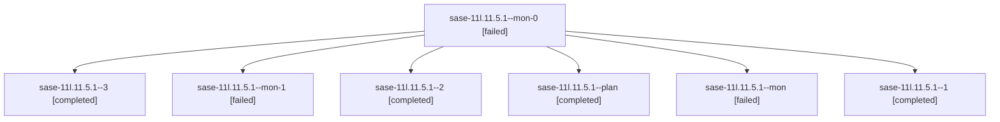

# Family: sase-11l.11.5.1

[Agent Hoods](../README.md) / [bbugyi200](../users/bbugyi200/README.md) / [athena](../users/bbugyi200/machines/athena/README.md) / [sase-11l](../users/bbugyi200/machines/athena/hoods/sase-11l/README.md) / sase-11l.11.5.1

Owner: `bbugyi200.athena` · Hood: `sase-11l` · Members: 7 · Bead: [sase-11l.11.5.1](https://github.com/sase-org/sase--beads/blob/main/pages/sase-11l/sase-11l.11.5.1.md)

## Lineage

The diagram is an optional enhancement; the ordered table below contains the same lineage in accessible text.

| Role | Agent | State | Model / provider | Timing | Commits | Prompt | Chat |
|---|---|---|---|---|---:|---|---|
| mon-0 | sase-11l.11.5.1--mon-0 | failed | grok-4.6 / grok | 2026-09-19T09:07:14.407038+00:00 → 2026-09-19T09:49:21.958421+00:00 | 0 | — | [Chat](../agents/bbugyi200.athena.sase-11l.11.5.1--mon-0/chat.md) |
| 3 | sase-11l.11.5.1--3 | completed | grok-4.6 / grok | 2026-09-19T10:04:13.179264+00:00 → 2026-09-19T10:12:53.913832+00:00 | [1](../agents/bbugyi200.athena.sase-11l.11.5.1--3/README.md#commits) | [Prompt](../agents/bbugyi200.athena.sase-11l.11.5.1--3/prompt.md) | [Chat](../agents/bbugyi200.athena.sase-11l.11.5.1--3/chat.md) |
| mon-1 | sase-11l.11.5.1--mon-1 | failed | grok-4.6 / grok | 2026-09-19T09:56:02.979893+00:00 → 2026-09-19T10:04:06.279196+00:00 | 0 | — | [Chat](../agents/bbugyi200.athena.sase-11l.11.5.1--mon-1/chat.md) |
| 2 | sase-11l.11.5.1--2 | completed | grok-4.6 / grok | 2026-09-19T09:49:33.061807+00:00 → 2026-09-19T09:56:51.081090+00:00 | 0 | [Prompt](../agents/bbugyi200.athena.sase-11l.11.5.1--2/prompt.md) | [Chat](../agents/bbugyi200.athena.sase-11l.11.5.1--2/chat.md) |
| plan | sase-11l.11.5.1--plan | completed | grok-4.6 / grok | 2026-09-19T08:39:06.058239+00:00 → 2026-09-19T08:47:18.849505+00:00 | 0 | [Prompt](../agents/bbugyi200.athena.sase-11l.11.5.1--plan/prompt.md) | [Chat](../agents/bbugyi200.athena.sase-11l.11.5.1--plan/chat.md) |
| mon | sase-11l.11.5.1--mon | failed | grok-4.6 / grok | 2026-09-19T08:46:58.520751+00:00 → 2026-09-19T09:01:37.354086+00:00 | 0 | — | [Chat](../agents/bbugyi200.athena.sase-11l.11.5.1--mon/chat.md) |
| 1 | sase-11l.11.5.1--1 | completed | grok-4.6 / grok | 2026-09-19T09:01:40.243832+00:00 → 2026-09-19T09:07:32.650250+00:00 | 0 | [Prompt](../agents/bbugyi200.athena.sase-11l.11.5.1--1/prompt.md) | [Chat](../agents/bbugyi200.athena.sase-11l.11.5.1--1/chat.md) |

## Commits

| Role | Repo | Commit | Subject | Committed |
|---|---|---|---|---|
| 3 | sase | [`0fc51c2`](https://github.com/sase-org/sase/commit/0fc51c29981ff59c742ae5261267a1acd9e2d2fb) | chore(core): ratchet hold-deadlock source pin | 2026-09-19 06:09:20 EDT |

## Neighbors

| Agent | Relation | State |
|---|---|---|
| [sase-11l.11.5.land](../agents/bbugyi200.athena.sase-11l.11.5.land/README.md) | sase-11l.11.5 hood | active |
| [sase-11l.11.1](bbugyi200.athena.sase-11l.11.1.md) (family · 7) | sase-11l.11 hood | completed 4, failed 3 |
| [sase-11l.11.2](bbugyi200.athena.sase-11l.11.2.md) (family · 5) | sase-11l.11 hood | completed 3, failed 2 |
| [sase-11l.11.3](bbugyi200.athena.sase-11l.11.3.md) (family · 3) | sase-11l.11 hood | completed 2, failed 1 |
| [sase-11l.11.4](bbugyi200.athena.sase-11l.11.4.md) (family · 5) | sase-11l.11 hood | completed 3, failed 2 |
| [sase-11l.11.land](bbugyi200.athena.sase-11l.11.land.md) (family · 3) | sase-11l.11 hood | failed 3 |
| [sase-11l.1](bbugyi200.athena.sase-11l.1.md) (family · 3) | sase-11l hood | completed 2, failed 1 |
| [sase-11l.10](bbugyi200.athena.sase-11l.10.md) (family · 11) | sase-11l hood | active 1, completed 4, failed 6 |
| [sase-11l.2](../agents/bbugyi200.athena.sase-11l.2/README.md) | sase-11l hood | completed |
| [sase-11l.3](bbugyi200.athena.sase-11l.3.md) (family · 3) | sase-11l hood | completed 2, failed 1 |
| [sase-11l.4](bbugyi200.athena.sase-11l.4.md) (family · 3) | sase-11l hood | completed 2, failed 1 |
| [sase-11l.5](bbugyi200.athena.sase-11l.5.md) (family · 3) | sase-11l hood | failed 3 |
| [sase-11l.5](../agents/bbugyi200.athena.sase-11l.5/README.md) | sase-11l hood | dismissed |
| [sase-11l.5.1.1](bbugyi200.athena.sase-11l.5.1.1.md) (family · 3) | sase-11l hood | active 2, completed 1 |
| [sase-11l.5.1.2](bbugyi200.athena.sase-11l.5.1.2.md) (family · 3) | sase-11l hood | active 3 |
| [sase-11l.5.1.2.1.1](../agents/bbugyi200.athena.sase-11l.5.1.2.1.1/README.md) | sase-11l hood | active |
| [sase-11l.5.1.2.1.2](../agents/bbugyi200.athena.sase-11l.5.1.2.1.2/README.md) | sase-11l hood | active |
| [sase-11l.5.1.2.1.3](../agents/bbugyi200.athena.sase-11l.5.1.2.1.3/README.md) | sase-11l hood | active |
| [sase-11l.5.1.2.1.4](../agents/bbugyi200.athena.sase-11l.5.1.2.1.4/README.md) | sase-11l hood | active |
| [sase-11l.5.1.2.1.land](bbugyi200.athena.sase-11l.5.1.2.1.land.md) (family · 3) | sase-11l hood | active 2, completed 1 |
| [sase-11l.5.1.2.1.land](../agents/bbugyi200.athena.sase-11l.5.1.2.1.land/README.md) | sase-11l hood | waiting |
| [sase-11l.5.1.3](bbugyi200.athena.sase-11l.5.1.3.md) (family · 3) | sase-11l hood | active 3 |
| [sase-11l.5.1.land](bbugyi200.athena.sase-11l.5.1.land.md) (family · 3) | sase-11l hood | active 3 |
| [sase-11l.6](../agents/bbugyi200.athena.sase-11l.6/README.md) | sase-11l hood | completed |
| [sase-11l.7](../agents/bbugyi200.athena.sase-11l.7/README.md) | sase-11l hood | completed |
| [sase-11l.8](../agents/bbugyi200.athena.sase-11l.8/README.md) | sase-11l hood | completed |
| [sase-11l.9](../agents/bbugyi200.athena.sase-11l.9/README.md) | sase-11l hood | completed |
| [sase-11l.land](bbugyi200.athena.sase-11l.land.md) (family · 3) | sase-11l hood | failed 3 |
