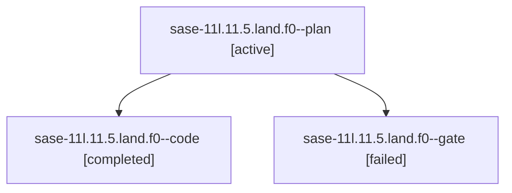

# Family: sase-11l.11.5.land.f0

[Agent Hoods](../README.md) / [bbugyi200](../users/bbugyi200/README.md) / [athena](../users/bbugyi200/machines/athena/README.md) / [sase-11l](../users/bbugyi200/machines/athena/hoods/sase-11l/README.md) / sase-11l.11.5.land.f0

Owner: `bbugyi200.athena` · Hood: `sase-11l` · Members: 3

## Lineage

The diagram is an optional enhancement; the ordered table below contains the same lineage in accessible text.

| Role | Agent | State | Model / provider | Timing | Commits | Prompt | Chat |
|---|---|---|---|---|---:|---|---|
| plan | sase-11l.11.5.land.f0--plan | active | grok-4.6 / grok | 2026-09-19T13:30:33.264965+00:00 | 0 | [Prompt](../agents/bbugyi200.athena.sase-11l.11.5.land.f0--plan/prompt.md) | [Chat](../agents/bbugyi200.athena.sase-11l.11.5.land.f0--plan/chat.md) |
| code | sase-11l.11.5.land.f0--code | completed | grok-4.6 / grok | 2026-09-19T14:02:47.030217+00:00 → 2026-09-19T14:26:37.514322+00:00 | [1](../agents/bbugyi200.athena.sase-11l.11.5.land.f0--code/README.md#commits) | [Prompt](../agents/bbugyi200.athena.sase-11l.11.5.land.f0--code/prompt.md) | [Chat](../agents/bbugyi200.athena.sase-11l.11.5.land.f0--code/chat.md) |
| gate | sase-11l.11.5.land.f0--gate | failed | grok-4.6 / grok | 2026-09-19T13:49:36.541559+00:00 → 2026-09-19T13:53:43.427424+00:00 | 0 | — | [Chat](../agents/bbugyi200.athena.sase-11l.11.5.land.f0--gate/chat.md) |

## Commits

| Role | Repo | Commit | Subject | Committed |
|---|---|---|---|---|
| code | sase | [`7b4cd80`](https://github.com/sase-org/sase/commit/7b4cd80fb52bb361b9384b8a6e089e62bd5f01f9) | fix: stabilize landing-gate test-cost failures | 2026-09-19 10:22:57 EDT |

## Neighbors

| Agent | Relation | State |
|---|---|---|
| [sase-11l.11.5.land](bbugyi200.athena.sase-11l.11.5.land.md) (family · 3) | ancestor | active 3 |
| [sase-11l.11.5.1](bbugyi200.athena.sase-11l.11.5.1.md) (family · 7) | sase-11l.11.5 hood | active 7 |
| [sase-11l.11.1](bbugyi200.athena.sase-11l.11.1.md) (family · 7) | sase-11l.11 hood | active 7 |
| [sase-11l.11.2](bbugyi200.athena.sase-11l.11.2.md) (family · 5) | sase-11l.11 hood | active 5 |
| [sase-11l.11.3](bbugyi200.athena.sase-11l.11.3.md) (family · 3) | sase-11l.11 hood | active 3 |
| [sase-11l.11.4](bbugyi200.athena.sase-11l.11.4.md) (family · 5) | sase-11l.11 hood | active 5 |
| [sase-11l.11.land](bbugyi200.athena.sase-11l.11.land.md) (family · 3) | sase-11l.11 hood | active 3 |
| [sase-11l.1](bbugyi200.athena.sase-11l.1.md) (family · 3) | sase-11l hood | active 2, completed 1 |
| [sase-11l.10](bbugyi200.athena.sase-11l.10.md) (family · 11) | sase-11l hood | active 1, completed 4, failed 6 |
| [sase-11l.2](../agents/bbugyi200.athena.sase-11l.2/README.md) | sase-11l hood | active |
| [sase-11l.3](bbugyi200.athena.sase-11l.3.md) (family · 3) | sase-11l hood | active 2, completed 1 |
| [sase-11l.4](bbugyi200.athena.sase-11l.4.md) (family · 3) | sase-11l hood | active 2, completed 1 |
| [sase-11l.5](bbugyi200.athena.sase-11l.5.md) (family · 3) | sase-11l hood | active 3 |
| [sase-11l.5](../agents/bbugyi200.athena.sase-11l.5/README.md) | sase-11l hood | dismissed |
| [sase-11l.5.1.1](bbugyi200.athena.sase-11l.5.1.1.md) (family · 3) | sase-11l hood | active 2, completed 1 |
| [sase-11l.5.1.2](bbugyi200.athena.sase-11l.5.1.2.md) (family · 3) | sase-11l hood | active 3 |
| [sase-11l.5.1.2.1.1](../agents/bbugyi200.athena.sase-11l.5.1.2.1.1/README.md) | sase-11l hood | active |
| [sase-11l.5.1.2.1.2](../agents/bbugyi200.athena.sase-11l.5.1.2.1.2/README.md) | sase-11l hood | active |
| [sase-11l.5.1.2.1.3](../agents/bbugyi200.athena.sase-11l.5.1.2.1.3/README.md) | sase-11l hood | active |
| [sase-11l.5.1.2.1.4](../agents/bbugyi200.athena.sase-11l.5.1.2.1.4/README.md) | sase-11l hood | active |
| [sase-11l.5.1.2.1.land](bbugyi200.athena.sase-11l.5.1.2.1.land.md) (family · 3) | sase-11l hood | active 2, completed 1 |
| [sase-11l.5.1.2.1.land](../agents/bbugyi200.athena.sase-11l.5.1.2.1.land/README.md) | sase-11l hood | waiting |
| [sase-11l.5.1.3](bbugyi200.athena.sase-11l.5.1.3.md) (family · 3) | sase-11l hood | active 3 |
| [sase-11l.5.1.land](bbugyi200.athena.sase-11l.5.1.land.md) (family · 3) | sase-11l hood | active 3 |
| [sase-11l.6](../agents/bbugyi200.athena.sase-11l.6/README.md) | sase-11l hood | active |
| [sase-11l.7](../agents/bbugyi200.athena.sase-11l.7/README.md) | sase-11l hood | active |
| [sase-11l.8](../agents/bbugyi200.athena.sase-11l.8/README.md) | sase-11l hood | active |
| [sase-11l.9](../agents/bbugyi200.athena.sase-11l.9/README.md) | sase-11l hood | active |
| [sase-11l.land](bbugyi200.athena.sase-11l.land.md) (family · 3) | sase-11l hood | active 3 |
