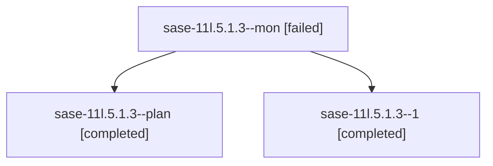

# Family: sase-11l.5.1.3

[Agent Hoods](../README.md) / [bbugyi200](../users/bbugyi200/README.md) / [athena](../users/bbugyi200/machines/athena/README.md) / [sase-11l](../users/bbugyi200/machines/athena/hoods/sase-11l/README.md) / sase-11l.5.1.3

Owner: `bbugyi200.athena` · Hood: `sase-11l` · Members: 3 · Bead: [sase-11l.5.1.3](https://github.com/sase-org/sase--beads/blob/main/pages/sase-11l/sase-11l.5.1.3.md)

## Lineage

The diagram is an optional enhancement; the ordered table below contains the same lineage in accessible text.

| Role | Agent | State | Model / provider | Timing | Commits | Prompt | Chat |
|---|---|---|---|---|---:|---|---|
| mon | sase-11l.5.1.3--mon | failed | sonnet / claude | 2026-09-16T21:48:20.289173+00:00 → 2026-09-16T22:17:00.963259+00:00 | 0 | — | [Chat](../agents/bbugyi200.athena.sase-11l.5.1.3--mon/chat.md) |
| plan | sase-11l.5.1.3--plan | completed | sonnet / claude | 2026-09-16T20:01:53.356697+00:00 → 2026-09-16T21:49:16.666885+00:00 | 0 | [Prompt](../agents/bbugyi200.athena.sase-11l.5.1.3--plan/prompt.md) | [Chat](../agents/bbugyi200.athena.sase-11l.5.1.3--plan/chat.md) |
| 1 | sase-11l.5.1.3--1 | completed | sonnet / claude | 2026-09-16T22:17:00.586509+00:00 → 2026-09-16T22:41:28.285208+00:00 | [1](../agents/bbugyi200.athena.sase-11l.5.1.3--1/README.md#commits) | [Prompt](../agents/bbugyi200.athena.sase-11l.5.1.3--1/prompt.md) | [Chat](../agents/bbugyi200.athena.sase-11l.5.1.3--1/chat.md) |

## Commits

| Role | Repo | Commit | Subject | Committed |
|---|---|---|---|---|
| 1 | sase | [`43c8721`](https://github.com/sase-org/sase/commit/43c87210f5821663c21d9198865f52f02473d009) | feat(agent-hold): preview pending %hold captures and confirm broad holds | 2026-09-16 18:38:38 EDT |

## Neighbors

| Agent | Relation | State |
|---|---|---|
| [sase-11l.5](../agents/bbugyi200.athena.sase-11l.5/README.md) | ancestor | dismissed |
| [sase-11l.5.1.1](bbugyi200.athena.sase-11l.5.1.1.md) (family · 3) | sase-11l.5.1 hood | completed 2, failed 1 |
| [sase-11l.5.1.2](bbugyi200.athena.sase-11l.5.1.2.md) (family · 3) | sase-11l.5.1 hood | failed 3 |
| [sase-11l.5.1.2.1.1](../agents/bbugyi200.athena.sase-11l.5.1.2.1.1/README.md) | sase-11l.5.1 hood | active |
| [sase-11l.5.1.2.1.2](../agents/bbugyi200.athena.sase-11l.5.1.2.1.2/README.md) | sase-11l.5.1 hood | active |
| [sase-11l.5.1.2.1.3](../agents/bbugyi200.athena.sase-11l.5.1.2.1.3/README.md) | sase-11l.5.1 hood | active |
| [sase-11l.5.1.2.1.4](../agents/bbugyi200.athena.sase-11l.5.1.2.1.4/README.md) | sase-11l.5.1 hood | active |
| [sase-11l.5.1.2.1.land](bbugyi200.athena.sase-11l.5.1.2.1.land.md) (family · 3) | sase-11l.5.1 hood | active 2, failed 1 |
| [sase-11l.5.1.2.1.land](../agents/bbugyi200.athena.sase-11l.5.1.2.1.land/README.md) | sase-11l.5.1 hood | waiting |
| [sase-11l.5.1.land](../agents/bbugyi200.athena.sase-11l.5.1.land/README.md) | sase-11l.5.1 hood | waiting |
| [sase-11l.1](bbugyi200.athena.sase-11l.1.md) (family · 3) | sase-11l hood | completed 2, failed 1 |
| [sase-11l.10](../agents/bbugyi200.athena.sase-11l.10/README.md) | sase-11l hood | waiting |
| [sase-11l.2](../agents/bbugyi200.athena.sase-11l.2/README.md) | sase-11l hood | completed |
| [sase-11l.3](bbugyi200.athena.sase-11l.3.md) (family · 3) | sase-11l hood | completed 2, failed 1 |
| [sase-11l.4](bbugyi200.athena.sase-11l.4.md) (family · 3) | sase-11l hood | completed 2, failed 1 |
| [sase-11l.6](../agents/bbugyi200.athena.sase-11l.6/README.md) | sase-11l hood | waiting |
| [sase-11l.7](../agents/bbugyi200.athena.sase-11l.7/README.md) | sase-11l hood | completed |
| [sase-11l.8](../agents/bbugyi200.athena.sase-11l.8/README.md) | sase-11l hood | completed |
| [sase-11l.9](../agents/bbugyi200.athena.sase-11l.9/README.md) | sase-11l hood | waiting |
| [sase-11l.land](../agents/bbugyi200.athena.sase-11l.land/README.md) | sase-11l hood | waiting |
