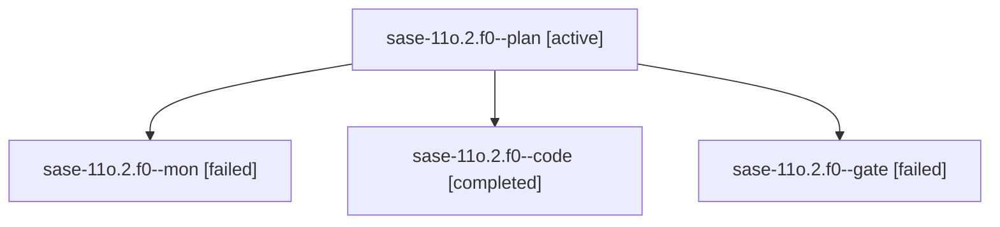

# Family: sase-11o.2.f0

[Agent Hoods](../README.md) / [bbugyi200](../users/bbugyi200/README.md) / [athena](../users/bbugyi200/machines/athena/README.md) / [sase-11o](../users/bbugyi200/machines/athena/hoods/sase-11o/README.md) / sase-11o.2.f0

Owner: `bbugyi200.athena` · Hood: `sase-11o` · Members: 4

## Lineage

The diagram is an optional enhancement; the ordered table below contains the same lineage in accessible text.

| Role | Agent | State | Model / provider | Timing | Commits | Prompt | Chat |
|---|---|---|---|---|---:|---|---|
| plan | sase-11o.2.f0--plan | active | gpt-6-astra / codex | 2026-09-16T17:06:52.089664+00:00 | 0 | [Prompt](../agents/bbugyi200.athena.sase-11o.2.f0--plan/prompt.md) | [Chat](../agents/bbugyi200.athena.sase-11o.2.f0--plan/chat.md) |
| mon | sase-11o.2.f0--mon | failed | gpt-5.5 / codex | 2026-09-16T18:33:38.874922+00:00 → 2026-09-16T19:31:36.336856+00:00 | 0 | — | [Chat](../agents/bbugyi200.athena.sase-11o.2.f0--mon/chat.md) |
| code | sase-11o.2.f0--code | completed | gpt-5.5 / codex | 2026-09-16T17:15:55.934204+00:00 → 2026-09-16T18:34:03.931482+00:00 | 0 | [Prompt](../agents/bbugyi200.athena.sase-11o.2.f0--code/prompt.md) | [Chat](../agents/bbugyi200.athena.sase-11o.2.f0--code/chat.md) |
| gate | sase-11o.2.f0--gate | failed | gpt-6-astra / codex | 2026-09-16T17:14:35.366565+00:00 → 2026-09-16T17:15:23.452010+00:00 | 0 | — | [Chat](../agents/bbugyi200.athena.sase-11o.2.f0--gate/chat.md) |

## Neighbors

| Agent | Relation | State |
|---|---|---|
| [sase-11o.2](../agents/bbugyi200.athena.sase-11o.2/README.md) | ancestor | active |
| [sase-11o.2.f1](bbugyi200.athena.sase-11o.2.f1.md) (family · 11) | sase-11o.2 hood | active 1, completed 5, failed 5 |
| [sase-11o.1](../agents/bbugyi200.athena.sase-11o.1/README.md) | sase-11o hood | active |
| [sase-11o.land](../agents/bbugyi200.athena.sase-11o.land/README.md) | sase-11o hood | active |
