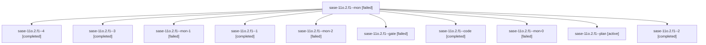

# Family: sase-11o.2.f1

[Agent Hoods](../README.md) / [bbugyi200](../users/bbugyi200/README.md) / [athena](../users/bbugyi200/machines/athena/README.md) / [sase-11o](../users/bbugyi200/machines/athena/hoods/sase-11o/README.md) / sase-11o.2.f1

Owner: `bbugyi200.athena` · Hood: `sase-11o` · Members: 11

## Lineage

The diagram is an optional enhancement; the ordered table below contains the same lineage in accessible text.

| Role | Agent | State | Model / provider | Timing | Commits | Prompt | Chat |
|---|---|---|---|---|---:|---|---|
| mon | sase-11o.2.f1--mon | failed | gpt-5.5 / codex | 2026-09-17T13:00:26.890437+00:00 → 2026-09-17T13:10:49.746040+00:00 | 0 | — | [Chat](../agents/bbugyi200.athena.sase-11o.2.f1--mon/chat.md) |
| 4 | sase-11o.2.f1--4 | completed | gpt-5.5 / codex | 2026-09-17T14:48:13.859693+00:00 → 2026-09-17T15:01:40.711976+00:00 | [1](../agents/bbugyi200.athena.sase-11o.2.f1--4/README.md#commits) | [Prompt](../agents/bbugyi200.athena.sase-11o.2.f1--4/prompt.md) | [Chat](../agents/bbugyi200.athena.sase-11o.2.f1--4/chat.md) |
| 3 | sase-11o.2.f1--3 | completed | gpt-5.5 / codex | 2026-09-17T14:31:48.294774+00:00 → 2026-09-17T14:36:00.246847+00:00 | 0 | [Prompt](../agents/bbugyi200.athena.sase-11o.2.f1--3/prompt.md) | [Chat](../agents/bbugyi200.athena.sase-11o.2.f1--3/chat.md) |
| mon-1 | sase-11o.2.f1--mon-1 | failed | gpt-5.5 / codex | 2026-09-17T14:26:11.118855+00:00 → 2026-09-17T14:31:48.751574+00:00 | 0 | — | [Chat](../agents/bbugyi200.athena.sase-11o.2.f1--mon-1/chat.md) |
| 1 | sase-11o.2.f1--1 | completed | gpt-5.5 / codex | 2026-09-17T14:06:17.893302+00:00 → 2026-09-17T14:14:47.784229+00:00 | 0 | [Prompt](../agents/bbugyi200.athena.sase-11o.2.f1--1/prompt.md) | [Chat](../agents/bbugyi200.athena.sase-11o.2.f1--1/chat.md) |
| mon-2 | sase-11o.2.f1--mon-2 | failed | gpt-5.5 / codex | 2026-09-17T14:34:49.997710+00:00 → 2026-09-17T14:46:52.664789+00:00 | 0 | — | [Chat](../agents/bbugyi200.athena.sase-11o.2.f1--mon-2/chat.md) |
| gate | sase-11o.2.f1--gate | failed | gpt-6-astra / codex | 2026-09-17T11:45:33.040282+00:00 → 2026-09-17T11:46:30.131130+00:00 | 0 | — | [Chat](../agents/bbugyi200.athena.sase-11o.2.f1--gate/chat.md) |
| code | sase-11o.2.f1--code | completed | gpt-5.5 / codex | 2026-09-17T11:46:52.513013+00:00 → 2026-09-17T13:01:11.872576+00:00 | 0 | [Prompt](../agents/bbugyi200.athena.sase-11o.2.f1--code/prompt.md) | [Chat](../agents/bbugyi200.athena.sase-11o.2.f1--code/chat.md) |
| mon-0 | sase-11o.2.f1--mon-0 | failed | gpt-5.5 / codex | 2026-09-17T14:14:28.741803+00:00 → 2026-09-17T14:24:10.520187+00:00 | 0 | — | [Chat](../agents/bbugyi200.athena.sase-11o.2.f1--mon-0/chat.md) |
| plan | sase-11o.2.f1--plan | active | gpt-6-astra / codex | 2026-09-17T11:37:39.984070+00:00 | 0 | [Prompt](../agents/bbugyi200.athena.sase-11o.2.f1--plan/prompt.md) | [Chat](../agents/bbugyi200.athena.sase-11o.2.f1--plan/chat.md) |
| 2 | sase-11o.2.f1--2 | completed | gpt-5.5 / codex | 2026-09-17T14:24:10.133187+00:00 → 2026-09-17T14:26:32.226504+00:00 | 0 | [Prompt](../agents/bbugyi200.athena.sase-11o.2.f1--2/prompt.md) | [Chat](../agents/bbugyi200.athena.sase-11o.2.f1--2/chat.md) |

## Commits

| Role | Repo | Commit | Subject | Committed |
|---|---|---|---|---|
| 4 | sase | [`44e697c`](https://github.com/sase-org/sase/commit/44e697c7145dcff1085ebd58c96504ff3c67e952) | feat(agents-sync): publish agent payloads in bounded batches | 2026-09-17 10:56:49 EDT |

## Neighbors

| Agent | Relation | State |
|---|---|---|
| [sase-11o.2](../agents/bbugyi200.athena.sase-11o.2/README.md) | ancestor | active |
| [sase-11o.2.f0](bbugyi200.athena.sase-11o.2.f0.md) (family · 4) | sase-11o.2 hood | active 1, completed 1, failed 2 |
| [sase-11o.1](../agents/bbugyi200.athena.sase-11o.1/README.md) | sase-11o hood | active |
| [sase-11o.land](../agents/bbugyi200.athena.sase-11o.land/README.md) | sase-11o hood | active |
