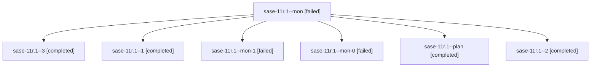

# Family: sase-11r.1

[Agent Hoods](../README.md) / [bbugyi200](../users/bbugyi200/README.md) / [athena](../users/bbugyi200/machines/athena/README.md) / [sase-11r](../users/bbugyi200/machines/athena/hoods/sase-11r/README.md) / sase-11r.1

Owner: `bbugyi200.athena` · Hood: `sase-11r` · Members: 7 · Bead: [sase-11r.1](https://github.com/sase-org/sase--beads/blob/main/pages/sase-11r/sase-11r.1.md)

## Lineage

The diagram is an optional enhancement; the ordered table below contains the same lineage in accessible text.

| Role | Agent | State | Model / provider | Timing | Commits | Prompt | Chat |
|---|---|---|---|---|---:|---|---|
| mon | sase-11r.1--mon | failed | sonnet / claude | 2026-09-16T14:35:42.682736+00:00 → 2026-09-16T14:38:52.230837+00:00 | 0 | — | [Chat](../agents/bbugyi200.athena.sase-11r.1--mon/chat.md) |
| 3 | sase-11r.1--3 | completed | sonnet / claude | 2026-09-16T16:56:39.664250+00:00 → 2026-09-16T17:08:11.589988+00:00 | [1](../agents/bbugyi200.athena.sase-11r.1--3/README.md#commits) | [Prompt](../agents/bbugyi200.athena.sase-11r.1--3/prompt.md) | [Chat](../agents/bbugyi200.athena.sase-11r.1--3/chat.md) |
| 1 | sase-11r.1--1 | completed | gpt-5.5 / codex | 2026-09-16T14:39:01.704023+00:00 → 2026-09-16T15:18:22.555272+00:00 | 0 | [Prompt](../agents/bbugyi200.athena.sase-11r.1--1/prompt.md) | [Chat](../agents/bbugyi200.athena.sase-11r.1--1/chat.md) |
| mon-1 | sase-11r.1--mon-1 | failed | sonnet / claude | 2026-09-16T16:17:58.688091+00:00 → 2026-09-16T16:56:04.132365+00:00 | 0 | — | [Chat](../agents/bbugyi200.athena.sase-11r.1--mon-1/chat.md) |
| mon-0 | sase-11r.1--mon-0 | failed | gpt-5.5 / codex | 2026-09-16T15:16:21.530029+00:00 → 2026-09-16T16:11:40.505383+00:00 | 0 | — | [Chat](../agents/bbugyi200.athena.sase-11r.1--mon-0/chat.md) |
| plan | sase-11r.1--plan | completed | sonnet / claude | 2026-09-16T14:09:24.278124+00:00 → 2026-09-16T14:36:17.649322+00:00 | 0 | [Prompt](../agents/bbugyi200.athena.sase-11r.1--plan/prompt.md) | [Chat](../agents/bbugyi200.athena.sase-11r.1--plan/chat.md) |
| 2 | sase-11r.1--2 | completed | sonnet / claude | 2026-09-16T16:11:40.429811+00:00 → 2026-09-16T16:18:39.736872+00:00 | 0 | [Prompt](../agents/bbugyi200.athena.sase-11r.1--2/prompt.md) | [Chat](../agents/bbugyi200.athena.sase-11r.1--2/chat.md) |

## Commits

| Role | Repo | Commit | Subject | Committed |
|---|---|---|---|---|
| 3 | sase | [`44f4c44`](https://github.com/sase-org/sase/commit/44f4c441706f5c58ab92a9fe503954d154fa2b95) | fix(monitor): close the monitor-settles-before-starter race | 2026-09-16 13:07:09 EDT |

## Neighbors

| Agent | Relation | State |
|---|---|---|
| [sase-11r.2](../agents/bbugyi200.athena.sase-11r.2/README.md) | sase-11r hood | active |
| [sase-11r.3](../agents/bbugyi200.athena.sase-11r.3/README.md) | sase-11r hood | completed |
| [sase-11r.land](../agents/bbugyi200.athena.sase-11r.land/README.md) | sase-11r hood | waiting |
