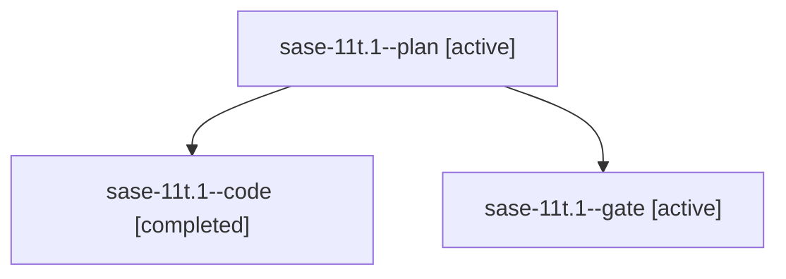

# Family: sase-11t.1

[Agent Hoods](../README.md) / [bbugyi200](../users/bbugyi200/README.md) / [athena](../users/bbugyi200/machines/athena/README.md) / [sase-11t](../users/bbugyi200/machines/athena/hoods/sase-11t/README.md) / sase-11t.1

Owner: `bbugyi200.athena` · Hood: `sase-11t` · Members: 3 · Bead: [sase-11t.1](https://github.com/sase-org/sase--beads/blob/main/pages/sase-11t/sase-11t.1.md)

## Lineage

The diagram is an optional enhancement; the ordered table below contains the same lineage in accessible text.

| Role | Agent | State | Model / provider | Timing | Commits | Prompt | Chat |
|---|---|---|---|---|---:|---|---|
| plan | sase-11t.1--plan | active | opus / claude | 2026-09-16T14:43:51.531567+00:00 | 0 | [Prompt](../agents/bbugyi200.athena.sase-11t.1--plan/prompt.md) | [Chat](../agents/bbugyi200.athena.sase-11t.1--plan/chat.md) |
| code | sase-11t.1--code | completed | gpt-5.5 / codex | 2026-09-16T14:59:06.037907+00:00 → 2026-09-16T16:16:01.142832+00:00 | [1](../agents/bbugyi200.athena.sase-11t.1--code/README.md#commits) | — | [Chat](../agents/bbugyi200.athena.sase-11t.1--code/chat.md) |
| gate | sase-11t.1--gate | active | opus / claude | 2026-09-16T14:57:47.719937+00:00 | 0 | — | [Chat](../agents/bbugyi200.athena.sase-11t.1--gate/chat.md) |

## Commits

| Role | Repo | Commit | Subject | Committed |
|---|---|---|---|---|
| code | sase | [`491daa9`](https://github.com/sase-org/sase/commit/491daa988a2095e3b7ad32105135e87bb6adbf68) | fix(gates): adjudicate lost gate intents | 2026-09-16 12:14:25 EDT |

## Neighbors

| Agent | Relation | State |
|---|---|---|
| [sase-11t.2](bbugyi200.athena.sase-11t.2.md) (family · 5) | sase-11t hood | active 5 |
| [sase-11t.3](bbugyi200.athena.sase-11t.3.md) (family · 3) | sase-11t hood | active 3 |
| [sase-11t.4](bbugyi200.athena.sase-11t.4.md) (family · 2) | sase-11t hood | active 2 |
| [sase-11t.land](../agents/bbugyi200.athena.sase-11t.land/README.md) | sase-11t hood | waiting |
