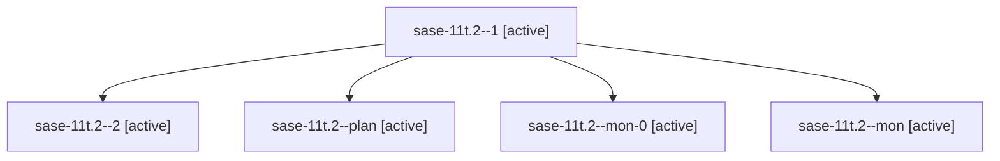

# Family: sase-11t.2

[Agent Hoods](../README.md) / [bbugyi200](../users/bbugyi200/README.md) / [athena](../users/bbugyi200/machines/athena/README.md) / [sase-11t](../users/bbugyi200/machines/athena/hoods/sase-11t/README.md) / sase-11t.2

Owner: `bbugyi200.athena` · Hood: `sase-11t` · Members: 5 · Bead: [sase-11t.2](https://github.com/sase-org/sase--beads/blob/main/pages/sase-11t/sase-11t.2.md)

## Lineage

The diagram is an optional enhancement; the ordered table below contains the same lineage in accessible text.

| Role | Agent | State | Model / provider | Timing | Commits | Prompt | Chat |
|---|---|---|---|---|---:|---|---|
| 1 | sase-11t.2--1 | active | gpt-5.5 / codex | 2026-09-16T17:03:01.944974+00:00 | 0 | [Prompt](../agents/bbugyi200.athena.sase-11t.2--1/prompt.md) | [Chat](../agents/bbugyi200.athena.sase-11t.2--1/chat.md) |
| 2 | sase-11t.2--2 | active | sonnet / claude | 2026-09-16T18:38:52.795833+00:00 | [1](../agents/bbugyi200.athena.sase-11t.2--2/README.md#commits) | [Prompt](../agents/bbugyi200.athena.sase-11t.2--2/prompt.md) | [Chat](../agents/bbugyi200.athena.sase-11t.2--2/chat.md) |
| plan | sase-11t.2--plan | active | gpt-5.5 / codex | 2026-09-16T14:44:14.377394+00:00 | 0 | [Prompt](../agents/bbugyi200.athena.sase-11t.2--plan/prompt.md) | [Chat](../agents/bbugyi200.athena.sase-11t.2--plan/chat.md) |
| mon-0 | sase-11t.2--mon-0 | active | gpt-5.5 / codex | 2026-09-16T17:21:05.402080+00:00 | 0 | — | [Chat](../agents/bbugyi200.athena.sase-11t.2--mon-0/chat.md) |
| mon | sase-11t.2--mon | active | gpt-5.5 / codex | 2026-09-16T15:31:45.013740+00:00 | 0 | — | [Chat](../agents/bbugyi200.athena.sase-11t.2--mon/chat.md) |

## Commits

| Role | Repo | Commit | Subject | Committed |
|---|---|---|---|---|
| 2 | sase | [`06a53a0`](https://github.com/sase-org/sase/commit/06a53a0e51ab815679e81f735a25d831458988c6) | fix(llm-provider): detect codex turn-integrity failures on empty-final killed-command turns | 2026-09-16 14:46:18 EDT |

## Neighbors

| Agent | Relation | State |
|---|---|---|
| [sase-11t.1](bbugyi200.athena.sase-11t.1.md) (family · 3) | sase-11t hood | active 2, completed 1 |
| [sase-11t.3](bbugyi200.athena.sase-11t.3.md) (family · 3) | sase-11t hood | active 3 |
| [sase-11t.4](bbugyi200.athena.sase-11t.4.md) (family · 2) | sase-11t hood | active 2 |
| [sase-11t.land](../agents/bbugyi200.athena.sase-11t.land/README.md) | sase-11t hood | waiting |
