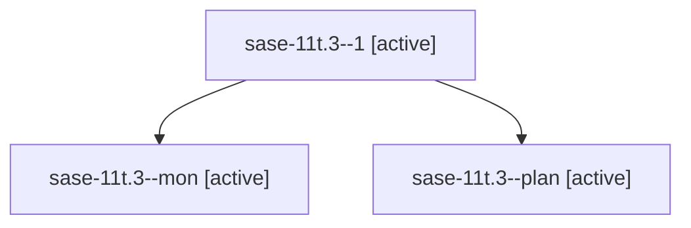

# Family: sase-11t.3

[Agent Hoods](../README.md) / [bbugyi200](../users/bbugyi200/README.md) / [athena](../users/bbugyi200/machines/athena/README.md) / [sase-11t](../users/bbugyi200/machines/athena/hoods/sase-11t/README.md) / sase-11t.3

Owner: `bbugyi200.athena` · Hood: `sase-11t` · Members: 3 · Bead: [sase-11t.3](https://github.com/sase-org/sase--beads/blob/main/pages/sase-11t/sase-11t.3.md)

## Lineage

The diagram is an optional enhancement; the ordered table below contains the same lineage in accessible text.

| Role | Agent | State | Model / provider | Timing | Commits | Prompt | Chat |
|---|---|---|---|---|---:|---|---|
| 1 | sase-11t.3--1 | active | sonnet / claude | 2026-09-16T15:18:00.501927+00:00 | [1](../agents/bbugyi200.athena.sase-11t.3--1/README.md#commits) | [Prompt](../agents/bbugyi200.athena.sase-11t.3--1/prompt.md) | [Chat](../agents/bbugyi200.athena.sase-11t.3--1/chat.md) |
| mon | sase-11t.3--mon | active | sonnet / claude | 2026-09-16T15:09:52.373655+00:00 | 0 | — | [Chat](../agents/bbugyi200.athena.sase-11t.3--mon/chat.md) |
| plan | sase-11t.3--plan | active | sonnet / claude | 2026-09-16T14:50:46.776602+00:00 | 0 | [Prompt](../agents/bbugyi200.athena.sase-11t.3--plan/prompt.md) | [Chat](../agents/bbugyi200.athena.sase-11t.3--plan/chat.md) |

## Commits

| Role | Repo | Commit | Subject | Committed |
|---|---|---|---|---|
| 1 | sase | [`9fc5e4d`](https://github.com/sase-org/sase/commit/9fc5e4d5cd884c66ea8e7bf96e3e7f97442c30c0) | docs(skills): add foreground-execution guidance to sudo/gate/run/questions skills | 2026-09-16 11:20:29 EDT |

## Neighbors

| Agent | Relation | State |
|---|---|---|
| [sase-11t.1](bbugyi200.athena.sase-11t.1.md) (family · 3) | sase-11t hood | active 2, completed 1 |
| [sase-11t.2](bbugyi200.athena.sase-11t.2.md) (family · 5) | sase-11t hood | active 5 |
| [sase-11t.4](bbugyi200.athena.sase-11t.4.md) (family · 2) | sase-11t hood | active 2 |
| [sase-11t.land](../agents/bbugyi200.athena.sase-11t.land/README.md) | sase-11t hood | waiting |
