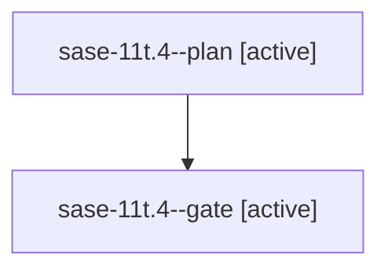

# Family: sase-11t.4

[Agent Hoods](../README.md) / [bbugyi200](../users/bbugyi200/README.md) / [athena](../users/bbugyi200/machines/athena/README.md) / [sase-11t](../users/bbugyi200/machines/athena/hoods/sase-11t/README.md) / sase-11t.4

Owner: `bbugyi200.athena` · Hood: `sase-11t` · Members: 2 · Bead: [sase-11t.4](https://github.com/sase-org/sase--beads/blob/main/pages/sase-11t/sase-11t.4.md)

## Lineage

The diagram is an optional enhancement; the ordered table below contains the same lineage in accessible text.

| Role | Agent | State | Model / provider | Timing | Commits | Prompt | Chat |
|---|---|---|---|---|---:|---|---|
| plan | sase-11t.4--plan | active | gpt-5.5 / codex | 2026-09-16T19:38:05.735605+00:00 | 0 | [Prompt](../agents/bbugyi200.athena.sase-11t.4--plan/prompt.md) | [Chat](../agents/bbugyi200.athena.sase-11t.4--plan/chat.md) |
| gate | sase-11t.4--gate | active | gpt-5.5 / codex | 2026-09-16T19:43:19.867121+00:00 | 0 | — | [Chat](../agents/bbugyi200.athena.sase-11t.4--gate/chat.md) |

## Neighbors

| Agent | Relation | State |
|---|---|---|
| [sase-11t.1](bbugyi200.athena.sase-11t.1.md) (family · 3) | sase-11t hood | active 2, completed 1 |
| [sase-11t.2](bbugyi200.athena.sase-11t.2.md) (family · 5) | sase-11t hood | active 5 |
| [sase-11t.3](bbugyi200.athena.sase-11t.3.md) (family · 3) | sase-11t hood | active 3 |
| [sase-11t.land](../agents/bbugyi200.athena.sase-11t.land/README.md) | sase-11t hood | waiting |
