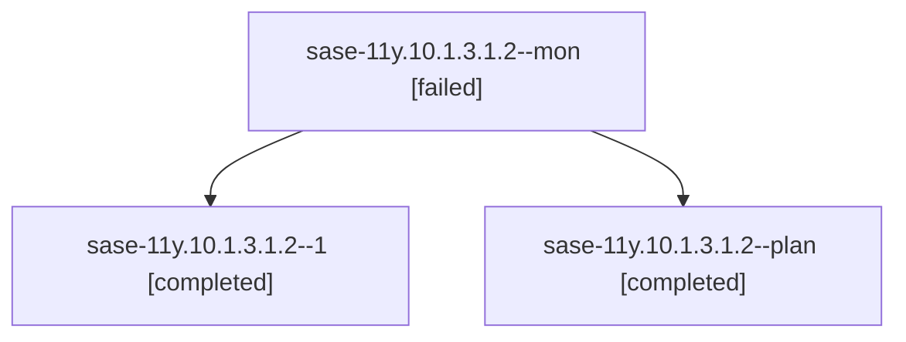

# Family: sase-11y.10.1.3.1.2

[Agent Hoods](../README.md) / [bbugyi200](../users/bbugyi200/README.md) / [athena](../users/bbugyi200/machines/athena/README.md) / [sase-11y](../users/bbugyi200/machines/athena/hoods/sase-11y/README.md) / sase-11y.10.1.3.1.2

Owner: `bbugyi200.athena` · Hood: `sase-11y` · Members: 3 · Bead: [sase-11y.10.1.3.1.2](https://github.com/sase-org/sase--beads/blob/main/pages/sase-11y/sase-11y.10.1.3.1.2.md)

## Lineage

The diagram is an optional enhancement; the ordered table below contains the same lineage in accessible text.

| Role | Agent | State | Model / provider | Timing | Commits | Prompt | Chat |
|---|---|---|---|---|---:|---|---|
| mon | sase-11y.10.1.3.1.2--mon | failed | muse-spark-1.3-contributor / muse | 2026-09-21T03:55:18.464834+00:00 → 2026-09-21T04:15:40.294014+00:00 | 0 | — | [Chat](../agents/bbugyi200.athena.sase-11y.10.1.3.1.2--mon/chat.md) |
| 1 | sase-11y.10.1.3.1.2--1 | completed | muse-spark-1.3-contributor / muse | 2026-09-21T04:16:18.755119+00:00 → 2026-09-21T04:26:58.593169+00:00 | [1](../agents/bbugyi200.athena.sase-11y.10.1.3.1.2--1/README.md#commits) | [Prompt](../agents/bbugyi200.athena.sase-11y.10.1.3.1.2--1/prompt.md) | [Chat](../agents/bbugyi200.athena.sase-11y.10.1.3.1.2--1/chat.md) |
| plan | sase-11y.10.1.3.1.2--plan | completed | muse-spark-1.3-contributor / muse | 2026-09-21T02:25:15.995026+00:00 → 2026-09-21T03:57:02.575881+00:00 | 0 | [Prompt](../agents/bbugyi200.athena.sase-11y.10.1.3.1.2--plan/prompt.md) | [Chat](../agents/bbugyi200.athena.sase-11y.10.1.3.1.2--plan/chat.md) |

## Commits

| Role | Repo | Commit | Subject | Committed |
|---|---|---|---|---|
| 1 | sase | [`c833ff3`](https://github.com/sase-org/sase/commit/c833ff3e5435457f991f47dd19cc120863e7f6bd) | refactor(axe): delete axe-start systemd scope wrapper and its evidence | 2026-09-21 00:22:52 EDT |

## Neighbors

| Agent | Relation | State |
|---|---|---|
| [sase-11y.10.1.3](bbugyi200.athena.sase-11y.10.1.3.md) (family · 3) | ancestor | failed 3 |
| [sase-11y.10](bbugyi200.athena.sase-11y.10.md) (family · 3) | ancestor | failed 3 |
| [sase-11y.10.1.3.1.1](../agents/bbugyi200.athena.sase-11y.10.1.3.1.1/README.md) | sase-11y.10.1.3.1 hood | completed |
| [sase-11y.10.1.3.1.3](../agents/bbugyi200.athena.sase-11y.10.1.3.1.3/README.md) | sase-11y.10.1.3.1 hood | completed |
| [sase-11y.10.1.3.1.4](../agents/bbugyi200.athena.sase-11y.10.1.3.1.4/README.md) | sase-11y.10.1.3.1 hood | completed |
| [sase-11y.10.1.3.1.5](../agents/bbugyi200.athena.sase-11y.10.1.3.1.5/README.md) | sase-11y.10.1.3.1 hood | completed |
| [sase-11y.10.1.3.1.land](../agents/bbugyi200.athena.sase-11y.10.1.3.1.land/README.md) | sase-11y.10.1.3.1 hood | completed |
| [sase-11y.10.1.1](../agents/bbugyi200.athena.sase-11y.10.1.1/README.md) | sase-11y.10.1 hood | completed |
| [sase-11y.10.1.2](bbugyi200.athena.sase-11y.10.1.2.md) (family · 3) | sase-11y.10.1 hood | completed 2, failed 1 |
| [sase-11y.10.1.4](bbugyi200.athena.sase-11y.10.1.4.md) (family · 9) | sase-11y.10.1 hood | completed 5, failed 4 |
| [sase-11y.10.1.5](../agents/bbugyi200.athena.sase-11y.10.1.5/README.md) | sase-11y.10.1 hood | completed |
| [sase-11y.10.1.6](../agents/bbugyi200.athena.sase-11y.10.1.6/README.md) | sase-11y.10.1 hood | completed |
| [sase-11y.10.1.land](../agents/bbugyi200.athena.sase-11y.10.1.land/README.md) | sase-11y.10.1 hood | active |
| [sase-11y.1](../agents/bbugyi200.athena.sase-11y.1/README.md) | sase-11y hood | completed |
| [sase-11y.2](bbugyi200.athena.sase-11y.2.md) (family · 3) | sase-11y hood | failed 3 |
| [sase-11y.2.1.1](../agents/bbugyi200.athena.sase-11y.2.1.1/README.md) | sase-11y hood | active |
| [sase-11y.2.1.2](bbugyi200.athena.sase-11y.2.1.2.md) (family · 5) | sase-11y hood | active 5 |
| [sase-11y.2.1.3](../agents/bbugyi200.athena.sase-11y.2.1.3/README.md) | sase-11y hood | active |
| [sase-11y.2.1.4](../agents/bbugyi200.athena.sase-11y.2.1.4/README.md) | sase-11y hood | active |
| [sase-11y.2.1.5.1](../agents/bbugyi200.athena.sase-11y.2.1.5.1/README.md) | sase-11y hood | active |
| [sase-11y.2.1.5.2](../agents/bbugyi200.athena.sase-11y.2.1.5.2/README.md) | sase-11y hood | active |
| [sase-11y.2.1.5.land](bbugyi200.athena.sase-11y.2.1.5.land.md) (family · 1) | sase-11y hood | active 1 |
| [sase-11y.2.1.land](bbugyi200.athena.sase-11y.2.1.land.md) (family · 3) | sase-11y hood | active 3 |
| [sase-11y.3](bbugyi200.athena.sase-11y.3.md) (family · 7) | sase-11y hood | completed 4, failed 3 |
| [sase-11y.4](bbugyi200.athena.sase-11y.4.md) (family · 3) | sase-11y hood | completed 2, failed 1 |
| [sase-11y.5](bbugyi200.athena.sase-11y.5.md) (family · 7) | sase-11y hood | completed 4, failed 3 |
| [sase-11y.6](bbugyi200.athena.sase-11y.6.md) (family · 3) | sase-11y hood | completed 2, failed 1 |
| [sase-11y.7](bbugyi200.athena.sase-11y.7.md) (family · 12) | sase-11y hood | active 1, completed 6, failed 5 |
| [sase-11y.7.f0](../agents/bbugyi200.athena.sase-11y.7.f0/README.md) | sase-11y hood | active |
| [sase-11y.7.f1](bbugyi200.athena.sase-11y.7.f1.md) (family · 2) | sase-11y hood | active 2 |
| [sase-11y.8](../agents/bbugyi200.athena.sase-11y.8/README.md) | sase-11y hood | completed |
| [sase-11y.9](../agents/bbugyi200.athena.sase-11y.9/README.md) | sase-11y hood | completed |
| [sase-11y.land](../agents/bbugyi200.athena.sase-11y.land/README.md) | sase-11y hood | waiting |
