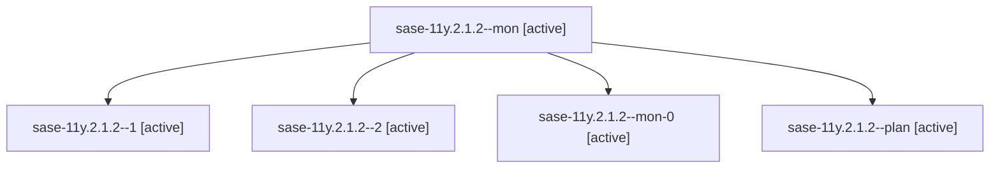

# Family: sase-11y.2.1.2

[Agent Hoods](../README.md) / [bbugyi200](../users/bbugyi200/README.md) / [athena](../users/bbugyi200/machines/athena/README.md) / [sase-11y](../users/bbugyi200/machines/athena/hoods/sase-11y/README.md) / sase-11y.2.1.2

Owner: `bbugyi200.athena` · Hood: `sase-11y` · Members: 5 · Bead: [sase-11y.2.1.2](https://github.com/sase-org/sase--beads/blob/main/pages/sase-11y/sase-11y.2.1.2.md)

## Lineage

The diagram is an optional enhancement; the ordered table below contains the same lineage in accessible text.

| Role | Agent | State | Model / provider | Timing | Commits | Prompt | Chat |
|---|---|---|---|---|---:|---|---|
| mon | sase-11y.2.1.2--mon | active | sonnet / claude | 2026-09-17T11:20:19.642460+00:00 | 0 | — | [Chat](../agents/bbugyi200.athena.sase-11y.2.1.2--mon/chat.md) |
| 1 | sase-11y.2.1.2--1 | active | sonnet / claude | 2026-09-17T11:41:45.538208+00:00 | 0 | [Prompt](../agents/bbugyi200.athena.sase-11y.2.1.2--1/prompt.md) | [Chat](../agents/bbugyi200.athena.sase-11y.2.1.2--1/chat.md) |
| 2 | sase-11y.2.1.2--2 | active | sonnet / claude | 2026-09-17T12:06:42.176842+00:00 | [1](../agents/bbugyi200.athena.sase-11y.2.1.2--2/README.md#commits) | [Prompt](../agents/bbugyi200.athena.sase-11y.2.1.2--2/prompt.md) | [Chat](../agents/bbugyi200.athena.sase-11y.2.1.2--2/chat.md) |
| mon-0 | sase-11y.2.1.2--mon-0 | active | sonnet / claude | 2026-09-17T11:46:11.364600+00:00 | 0 | — | [Chat](../agents/bbugyi200.athena.sase-11y.2.1.2--mon-0/chat.md) |
| plan | sase-11y.2.1.2--plan | active | sonnet / claude | 2026-09-17T10:28:36.346337+00:00 | 0 | [Prompt](../agents/bbugyi200.athena.sase-11y.2.1.2--plan/prompt.md) | [Chat](../agents/bbugyi200.athena.sase-11y.2.1.2--plan/chat.md) |

## Commits

| Role | Repo | Commit | Subject | Committed |
|---|---|---|---|---|
| 2 | sase | [`7aef336`](https://github.com/sase-org/sase/commit/7aef3364e22929aba2bc495306313ff17189c549) | feat(tui): promote visual rasterizer | 2026-09-17 09:55:49 EDT |
| — | sase | [`c74fb37`](https://github.com/sase-org/sase/commit/c74fb37065a69795d0f592f87729202bac12be91) | feat(service): add service.procs config composer, schema, defaults, and loader | 2026-09-17 10:06:09 EDT |

## Neighbors

| Agent | Relation | State |
|---|---|---|
| [sase-11y.2](bbugyi200.athena.sase-11y.2.md) (family · 3) | ancestor | failed 3 |
| [sase-11y.2.1.1](../agents/bbugyi200.athena.sase-11y.2.1.1/README.md) | sase-11y.2.1 hood | active |
| [sase-11y.2.1.3](../agents/bbugyi200.athena.sase-11y.2.1.3/README.md) | sase-11y.2.1 hood | active |
| [sase-11y.2.1.4](../agents/bbugyi200.athena.sase-11y.2.1.4/README.md) | sase-11y.2.1 hood | completed |
| [sase-11y.2.1.5.1](../agents/bbugyi200.athena.sase-11y.2.1.5.1/README.md) | sase-11y.2.1 hood | completed |
| [sase-11y.2.1.5.2](../agents/bbugyi200.athena.sase-11y.2.1.5.2/README.md) | sase-11y.2.1 hood | completed |
| [sase-11y.2.1.5.land](bbugyi200.athena.sase-11y.2.1.5.land.md) (family · 1) | sase-11y.2.1 hood | active 1 |
| [sase-11y.2.1.land](bbugyi200.athena.sase-11y.2.1.land.md) (family · 3) | sase-11y.2.1 hood | failed 3 |
| [sase-11y.1](../agents/bbugyi200.athena.sase-11y.1/README.md) | sase-11y hood | completed |
| [sase-11y.10](../agents/bbugyi200.athena.sase-11y.10/README.md) | sase-11y hood | waiting |
| [sase-11y.3](bbugyi200.athena.sase-11y.3.md) (family · 7) | sase-11y hood | completed 4, failed 3 |
| [sase-11y.4](../agents/bbugyi200.athena.sase-11y.4/README.md) | sase-11y hood | waiting |
| [sase-11y.5](../agents/bbugyi200.athena.sase-11y.5/README.md) | sase-11y hood | waiting |
| [sase-11y.6](../agents/bbugyi200.athena.sase-11y.6/README.md) | sase-11y hood | waiting |
| [sase-11y.7](../agents/bbugyi200.athena.sase-11y.7/README.md) | sase-11y hood | waiting |
| [sase-11y.8](../agents/bbugyi200.athena.sase-11y.8/README.md) | sase-11y hood | waiting |
| [sase-11y.9](../agents/bbugyi200.athena.sase-11y.9/README.md) | sase-11y hood | waiting |
| [sase-11y.land](../agents/bbugyi200.athena.sase-11y.land/README.md) | sase-11y hood | waiting |
