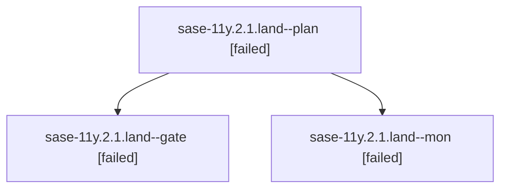

# Family: sase-11y.2.1.land

[Agent Hoods](../README.md) / [bbugyi200](../users/bbugyi200/README.md) / [athena](../users/bbugyi200/machines/athena/README.md) / [sase-11y](../users/bbugyi200/machines/athena/hoods/sase-11y/README.md) / sase-11y.2.1.land

Owner: `bbugyi200.athena` · Hood: `sase-11y` · Members: 3 · Bead: [sase-11y.2.1](https://github.com/sase-org/sase--beads/blob/main/pages/sase-11y/sase-11y.2.1.md)

## Lineage

The diagram is an optional enhancement; the ordered table below contains the same lineage in accessible text.

| Role | Agent | State | Model / provider | Timing | Commits | Prompt | Chat |
|---|---|---|---|---|---:|---|---|
| plan | sase-11y.2.1.land--plan | failed | gpt-5.6-sol / codex | 2026-09-17T23:28:44.405961+00:00 → 2026-09-17T23:38:54.653792+00:00 | 0 | [Prompt](../agents/bbugyi200.athena.sase-11y.2.1.land--plan/prompt.md) | [Chat](../agents/bbugyi200.athena.sase-11y.2.1.land--plan/chat.md) |
| gate | sase-11y.2.1.land--gate | failed | gpt-5.6-sol / codex | 2026-09-17T23:38:00.492970+00:00 → 2026-09-17T23:38:50.223435+00:00 | 0 | — | [Chat](../agents/bbugyi200.athena.sase-11y.2.1.land--gate/chat.md) |
| mon | sase-11y.2.1.land--mon | failed | gpt-5.6-sol / codex | 2026-09-17T23:38:40.609925+00:00 → 2026-09-17T23:40:28.660772+00:00 | 0 | — | [Chat](../agents/bbugyi200.athena.sase-11y.2.1.land--mon/chat.md) |

## Neighbors

| Agent | Relation | State |
|---|---|---|
| [sase-11y.2](bbugyi200.athena.sase-11y.2.md) (family · 3) | ancestor | failed 3 |
| [sase-11y.2.1.1](../agents/bbugyi200.athena.sase-11y.2.1.1/README.md) | sase-11y.2.1 hood | active |
| [sase-11y.2.1.2](bbugyi200.athena.sase-11y.2.1.2.md) (family · 5) | sase-11y.2.1 hood | active 5 |
| [sase-11y.2.1.3](../agents/bbugyi200.athena.sase-11y.2.1.3/README.md) | sase-11y.2.1 hood | active |
| [sase-11y.2.1.4](../agents/bbugyi200.athena.sase-11y.2.1.4/README.md) | sase-11y.2.1 hood | completed |
| [sase-11y.2.1.5.1](../agents/bbugyi200.athena.sase-11y.2.1.5.1/README.md) | sase-11y.2.1 hood | completed |
| [sase-11y.2.1.5.2](../agents/bbugyi200.athena.sase-11y.2.1.5.2/README.md) | sase-11y.2.1 hood | active |
| [sase-11y.2.1.5.land](../agents/bbugyi200.athena.sase-11y.2.1.5.land/README.md) | sase-11y.2.1 hood | waiting |
| [sase-11y.1](../agents/bbugyi200.athena.sase-11y.1/README.md) | sase-11y hood | completed |
| [sase-11y.10](../agents/bbugyi200.athena.sase-11y.10/README.md) | sase-11y hood | waiting |
| [sase-11y.3](bbugyi200.athena.sase-11y.3.md) (family · 7) | sase-11y hood | completed 4, failed 3 |
| [sase-11y.4](../agents/bbugyi200.athena.sase-11y.4/README.md) | sase-11y hood | waiting |
| [sase-11y.5](../agents/bbugyi200.athena.sase-11y.5/README.md) | sase-11y hood | waiting |
| [sase-11y.6](../agents/bbugyi200.athena.sase-11y.6/README.md) | sase-11y hood | waiting |
| [sase-11y.7](../agents/bbugyi200.athena.sase-11y.7/README.md) | sase-11y hood | waiting |
| [sase-11y.8](../agents/bbugyi200.athena.sase-11y.8/README.md) | sase-11y hood | waiting |
| [sase-11y.9](../agents/bbugyi200.athena.sase-11y.9/README.md) | sase-11y hood | waiting |
| [sase-11y.land](../agents/bbugyi200.athena.sase-11y.land/README.md) | sase-11y hood | waiting |
