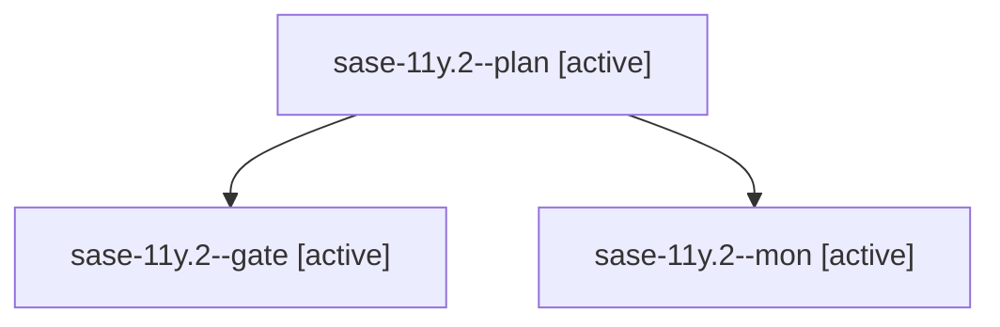

# Family: sase-11y.2

[Agent Hoods](../README.md) / [bbugyi200](../users/bbugyi200/README.md) / [athena](../users/bbugyi200/machines/athena/README.md) / [sase-11y](../users/bbugyi200/machines/athena/hoods/sase-11y/README.md) / sase-11y.2

Owner: `bbugyi200.athena` · Hood: `sase-11y` · Members: 3 · Bead: [sase-11y.2](https://github.com/sase-org/sase--beads/blob/main/pages/sase-11y/sase-11y.2.md)

## Lineage

The diagram is an optional enhancement; the ordered table below contains the same lineage in accessible text.

| Role | Agent | State | Model / provider | Timing | Commits | Prompt | Chat |
|---|---|---|---|---|---:|---|---|
| plan | sase-11y.2--plan | active | opus / claude | 2026-09-16T18:56:47.065458+00:00 | 0 | [Prompt](../agents/bbugyi200.athena.sase-11y.2--plan/prompt.md) | [Chat](../agents/bbugyi200.athena.sase-11y.2--plan/chat.md) |
| gate | sase-11y.2--gate | active | opus / claude | 2026-09-16T19:13:16.922871+00:00 | 0 | — | [Chat](../agents/bbugyi200.athena.sase-11y.2--gate/chat.md) |
| mon | sase-11y.2--mon | active | opus / claude | 2026-09-16T19:15:16.985194+00:00 | 0 | — | [Chat](../agents/bbugyi200.athena.sase-11y.2--mon/chat.md) |

## Neighbors

| Agent | Relation | State |
|---|---|---|
| [sase-11y.2.1.1](../agents/bbugyi200.athena.sase-11y.2.1.1/README.md) | descendant | active |
| [sase-11y.2.1.2](bbugyi200.athena.sase-11y.2.1.2.md) (family · 5) | descendant | active 5 |
| [sase-11y.2.1.3](../agents/bbugyi200.athena.sase-11y.2.1.3/README.md) | descendant | active |
| [sase-11y.2.1.4](../agents/bbugyi200.athena.sase-11y.2.1.4/README.md) | descendant | active |
| [sase-11y.2.1.5.1](../agents/bbugyi200.athena.sase-11y.2.1.5.1/README.md) | descendant | active |
| [sase-11y.2.1.5.2](../agents/bbugyi200.athena.sase-11y.2.1.5.2/README.md) | descendant | active |
| [sase-11y.2.1.5.land](bbugyi200.athena.sase-11y.2.1.5.land.md) (family · 1) | descendant | active 1 |
| [sase-11y.2.1.land](bbugyi200.athena.sase-11y.2.1.land.md) (family · 3) | descendant | active 3 |
| [sase-11y.1](../agents/bbugyi200.athena.sase-11y.1/README.md) | sase-11y hood | active |
| [sase-11y.10](bbugyi200.athena.sase-11y.10.md) (family · 3) | sase-11y hood | active 3 |
| [sase-11y.10.1.1](../agents/bbugyi200.athena.sase-11y.10.1.1/README.md) | sase-11y hood | active |
| [sase-11y.10.1.2](bbugyi200.athena.sase-11y.10.1.2.md) (family · 3) | sase-11y hood | active 2, completed 1 |
| [sase-11y.10.1.3](bbugyi200.athena.sase-11y.10.1.3.md) (family · 3) | sase-11y hood | active 3 |
| [sase-11y.10.1.3.1.1](../agents/bbugyi200.athena.sase-11y.10.1.3.1.1/README.md) | sase-11y hood | active |
| [sase-11y.10.1.3.1.2](bbugyi200.athena.sase-11y.10.1.3.1.2.md) (family · 3) | sase-11y hood | active 3 |
| [sase-11y.10.1.3.1.3](../agents/bbugyi200.athena.sase-11y.10.1.3.1.3/README.md) | sase-11y hood | active |
| [sase-11y.10.1.3.1.4](../agents/bbugyi200.athena.sase-11y.10.1.3.1.4/README.md) | sase-11y hood | active |
| [sase-11y.10.1.3.1.5](../agents/bbugyi200.athena.sase-11y.10.1.3.1.5/README.md) | sase-11y hood | active |
| [sase-11y.10.1.3.1.land](../agents/bbugyi200.athena.sase-11y.10.1.3.1.land/README.md) | sase-11y hood | active |
| [sase-11y.10.1.4](bbugyi200.athena.sase-11y.10.1.4.md) (family · 9) | sase-11y hood | active 7, completed 1, failed 1 |
| [sase-11y.10.1.5](../agents/bbugyi200.athena.sase-11y.10.1.5/README.md) | sase-11y hood | active |
| [sase-11y.10.1.6](../agents/bbugyi200.athena.sase-11y.10.1.6/README.md) | sase-11y hood | active |
| [sase-11y.10.1.7.1](../agents/bbugyi200.athena.sase-11y.10.1.7.1/README.md) | sase-11y hood | active |
| [sase-11y.10.1.7.2](../agents/bbugyi200.athena.sase-11y.10.1.7.2/README.md) | sase-11y hood | active |
| [sase-11y.10.1.7.3](../agents/bbugyi200.athena.sase-11y.10.1.7.3/README.md) | sase-11y hood | active |
| [sase-11y.10.1.7.4](../agents/bbugyi200.athena.sase-11y.10.1.7.4/README.md) | sase-11y hood | active |
| [sase-11y.10.1.7.5](../agents/bbugyi200.athena.sase-11y.10.1.7.5/README.md) | sase-11y hood | active |
| [sase-11y.10.1.7.6](../agents/bbugyi200.athena.sase-11y.10.1.7.6/README.md) | sase-11y hood | active |
| [sase-11y.10.1.7.land](../agents/bbugyi200.athena.sase-11y.10.1.7.land/README.md) | sase-11y hood | active |
| [sase-11y.10.1.land](bbugyi200.athena.sase-11y.10.1.land.md) (family · 3) | sase-11y hood | active 3 |
| [sase-11y.11.1](../agents/bbugyi200.athena.sase-11y.11.1/README.md) | sase-11y hood | active |
| [sase-11y.11.2](../agents/bbugyi200.athena.sase-11y.11.2/README.md) | sase-11y hood | active |
| [sase-11y.11.3](../agents/bbugyi200.athena.sase-11y.11.3/README.md) | sase-11y hood | active |
| [sase-11y.11.4](../agents/bbugyi200.athena.sase-11y.11.4/README.md) | sase-11y hood | active |
| [sase-11y.11.5](../agents/bbugyi200.athena.sase-11y.11.5/README.md) | sase-11y hood | active |
| [sase-11y.11.land](../agents/bbugyi200.athena.sase-11y.11.land/README.md) | sase-11y hood | active |
| [sase-11y.3](bbugyi200.athena.sase-11y.3.md) (family · 7) | sase-11y hood | active 7 |
| [sase-11y.4](bbugyi200.athena.sase-11y.4.md) (family · 3) | sase-11y hood | active 2, completed 1 |
| [sase-11y.5](bbugyi200.athena.sase-11y.5.md) (family · 7) | sase-11y hood | active 5, completed 1, failed 1 |
| [sase-11y.6](bbugyi200.athena.sase-11y.6.md) (family · 3) | sase-11y hood | active 2, completed 1 |
| [sase-11y.7](bbugyi200.athena.sase-11y.7.md) (family · 12) | sase-11y hood | active 3, completed 5, failed 4 |
| [sase-11y.7.f0](../agents/bbugyi200.athena.sase-11y.7.f0/README.md) | sase-11y hood | active |
| [sase-11y.7.f1](bbugyi200.athena.sase-11y.7.f1.md) (family · 2) | sase-11y hood | active 2 |
| [sase-11y.8](../agents/bbugyi200.athena.sase-11y.8/README.md) | sase-11y hood | active |
| [sase-11y.9](../agents/bbugyi200.athena.sase-11y.9/README.md) | sase-11y hood | active |
| [sase-11y.land](bbugyi200.athena.sase-11y.land.md) (family · 3) | sase-11y hood | active 3 |
