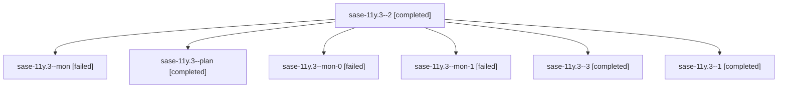

# Family: sase-11y.3

[Agent Hoods](../README.md) / [bbugyi200](../users/bbugyi200/README.md) / [athena](../users/bbugyi200/machines/athena/README.md) / [sase-11y](../users/bbugyi200/machines/athena/hoods/sase-11y/README.md) / sase-11y.3

Owner: `bbugyi200.athena` · Hood: `sase-11y` · Members: 7 · Bead: [sase-11y.3](https://github.com/sase-org/sase--beads/blob/main/pages/sase-11y/sase-11y.3.md)

## Lineage

The diagram is an optional enhancement; the ordered table below contains the same lineage in accessible text.

| Role | Agent | State | Model / provider | Timing | Commits | Prompt | Chat |
|---|---|---|---|---|---:|---|---|
| 2 | sase-11y.3--2 | completed | gpt-5.5 / codex | 2026-09-16T21:21:04.483494+00:00 → 2026-09-16T21:37:10.356126+00:00 | 0 | [Prompt](../agents/bbugyi200.athena.sase-11y.3--2/prompt.md) | [Chat](../agents/bbugyi200.athena.sase-11y.3--2/chat.md) |
| mon | sase-11y.3--mon | failed | sonnet / claude | 2026-09-16T19:13:07.667332+00:00 → 2026-09-16T19:44:34.574544+00:00 | 0 | — | [Chat](../agents/bbugyi200.athena.sase-11y.3--mon/chat.md) |
| plan | sase-11y.3--plan | completed | sonnet / claude | 2026-09-16T19:01:28.696214+00:00 → 2026-09-16T19:14:10.144672+00:00 | 0 | [Prompt](../agents/bbugyi200.athena.sase-11y.3--plan/prompt.md) | [Chat](../agents/bbugyi200.athena.sase-11y.3--plan/chat.md) |
| mon-0 | sase-11y.3--mon-0 | failed | sonnet / claude | 2026-09-16T20:04:13.835486+00:00 → 2026-09-16T21:20:44.616628+00:00 | 0 | — | [Chat](../agents/bbugyi200.athena.sase-11y.3--mon-0/chat.md) |
| mon-1 | sase-11y.3--mon-1 | failed | gpt-5.5 / codex | 2026-09-16T21:36:51.651168+00:00 → 2026-09-16T21:47:10.390044+00:00 | 0 | — | [Chat](../agents/bbugyi200.athena.sase-11y.3--mon-1/chat.md) |
| 3 | sase-11y.3--3 | completed | sonnet / claude | 2026-09-16T21:47:21.744214+00:00 → 2026-09-16T21:52:23.135155+00:00 | [1](../agents/bbugyi200.athena.sase-11y.3--3/README.md#commits) | [Prompt](../agents/bbugyi200.athena.sase-11y.3--3/prompt.md) | [Chat](../agents/bbugyi200.athena.sase-11y.3--3/chat.md) |
| 1 | sase-11y.3--1 | completed | sonnet / claude | 2026-09-16T19:45:33.617823+00:00 → 2026-09-16T20:04:38.368034+00:00 | 0 | [Prompt](../agents/bbugyi200.athena.sase-11y.3--1/prompt.md) | [Chat](../agents/bbugyi200.athena.sase-11y.3--1/chat.md) |

## Commits

| Role | Repo | Commit | Subject | Committed |
|---|---|---|---|---|
| 3 | sase | [`dfb07cb`](https://github.com/sase-org/sase/commit/dfb07cbbbdff4c9f1e9808a79aef92599ebb4ac4) | refactor(axe): extract child-supervision logic into supervision-lib | 2026-09-16 17:49:35 EDT |

## Neighbors

| Agent | Relation | State |
|---|---|---|
| [sase-11y.1](../agents/bbugyi200.athena.sase-11y.1/README.md) | sase-11y hood | completed |
| [sase-11y.10](../agents/bbugyi200.athena.sase-11y.10/README.md) | sase-11y hood | waiting |
| [sase-11y.2](bbugyi200.athena.sase-11y.2.md) (family · 3) | sase-11y hood | failed 3 |
| [sase-11y.2.1.1](../agents/bbugyi200.athena.sase-11y.2.1.1/README.md) | sase-11y hood | active |
| [sase-11y.2.1.2](bbugyi200.athena.sase-11y.2.1.2.md) (family · 5) | sase-11y hood | active 5 |
| [sase-11y.2.1.3](../agents/bbugyi200.athena.sase-11y.2.1.3/README.md) | sase-11y hood | active |
| [sase-11y.2.1.4](../agents/bbugyi200.athena.sase-11y.2.1.4/README.md) | sase-11y hood | completed |
| [sase-11y.2.1.5.1](../agents/bbugyi200.athena.sase-11y.2.1.5.1/README.md) | sase-11y hood | completed |
| [sase-11y.2.1.5.2](../agents/bbugyi200.athena.sase-11y.2.1.5.2/README.md) | sase-11y hood | completed |
| [sase-11y.2.1.5.land](bbugyi200.athena.sase-11y.2.1.5.land.md) (family · 1) | sase-11y hood | active 1 |
| [sase-11y.2.1.land](bbugyi200.athena.sase-11y.2.1.land.md) (family · 3) | sase-11y hood | failed 3 |
| [sase-11y.4](../agents/bbugyi200.athena.sase-11y.4/README.md) | sase-11y hood | waiting |
| [sase-11y.5](../agents/bbugyi200.athena.sase-11y.5/README.md) | sase-11y hood | waiting |
| [sase-11y.6](../agents/bbugyi200.athena.sase-11y.6/README.md) | sase-11y hood | waiting |
| [sase-11y.7](../agents/bbugyi200.athena.sase-11y.7/README.md) | sase-11y hood | waiting |
| [sase-11y.8](../agents/bbugyi200.athena.sase-11y.8/README.md) | sase-11y hood | waiting |
| [sase-11y.9](../agents/bbugyi200.athena.sase-11y.9/README.md) | sase-11y hood | waiting |
| [sase-11y.land](../agents/bbugyi200.athena.sase-11y.land/README.md) | sase-11y hood | waiting |
