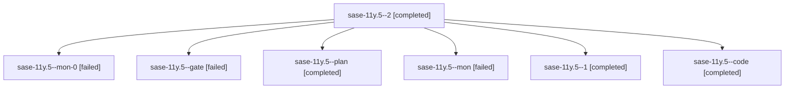

# Family: sase-11y.5

[Agent Hoods](../README.md) / [bbugyi200](../users/bbugyi200/README.md) / [athena](../users/bbugyi200/machines/athena/README.md) / [sase-11y](../users/bbugyi200/machines/athena/hoods/sase-11y/README.md) / sase-11y.5

Owner: `bbugyi200.athena` · Hood: `sase-11y` · Members: 7 · Bead: [sase-11y.5](https://github.com/sase-org/sase--beads/blob/main/pages/sase-11y/sase-11y.5.md)

## Lineage

The diagram is an optional enhancement; the ordered table below contains the same lineage in accessible text.

| Role | Agent | State | Model / provider | Timing | Commits | Prompt | Chat |
|---|---|---|---|---|---:|---|---|
| 2 | sase-11y.5--2 | completed | grok-4.6 / grok | 2026-09-19T12:53:14.349142+00:00 → 2026-09-19T14:01:53.271951+00:00 | [1](../agents/bbugyi200.athena.sase-11y.5--2/README.md#commits) | [Prompt](../agents/bbugyi200.athena.sase-11y.5--2/prompt.md) | [Chat](../agents/bbugyi200.athena.sase-11y.5--2/chat.md) |
| mon-0 | sase-11y.5--mon-0 | failed | grok-4.6 / grok | 2026-09-19T12:15:10.794650+00:00 → 2026-09-19T12:39:40.529379+00:00 | 0 | — | [Chat](../agents/bbugyi200.athena.sase-11y.5--mon-0/chat.md) |
| gate | sase-11y.5--gate | failed | grok-4.6 / grok | 2026-09-19T10:23:43.169298+00:00 → 2026-09-19T10:24:19.231381+00:00 | 0 | — | [Chat](../agents/bbugyi200.athena.sase-11y.5--gate/chat.md) |
| plan | sase-11y.5--plan | completed | grok-4.6 / grok | 2026-09-19T10:14:45.142966+00:00 → 2026-09-19T11:20:21.388576+00:00 | 0 | [Prompt](../agents/bbugyi200.athena.sase-11y.5--plan/prompt.md) | [Chat](../agents/bbugyi200.athena.sase-11y.5--plan/chat.md) |
| mon | sase-11y.5--mon | failed | grok-4.6 / grok | 2026-09-19T11:18:26.206021+00:00 → 2026-09-19T12:08:45.053611+00:00 | 0 | — | [Chat](../agents/bbugyi200.athena.sase-11y.5--mon/chat.md) |
| 1 | sase-11y.5--1 | completed | grok-4.6 / grok | 2026-09-19T12:08:43.837947+00:00 → 2026-09-19T12:16:04.809331+00:00 | 0 | [Prompt](../agents/bbugyi200.athena.sase-11y.5--1/prompt.md) | [Chat](../agents/bbugyi200.athena.sase-11y.5--1/chat.md) |
| code | sase-11y.5--code | completed | grok-4.6 / grok | 2026-09-19T10:24:42.003967+00:00 → 2026-09-19T11:20:21.388576+00:00 | 0 | — | [Chat](../agents/bbugyi200.athena.sase-11y.5--code/chat.md) |

## Commits

| Role | Repo | Commit | Subject | Committed |
|---|---|---|---|---|
| — | sase | [`3fb42fa`](https://github.com/sase-org/sase/commit/3fb42fa11ee2ba0539a085484edb2e3f98e6dd1f) | feat(service): add platform unit integration | 2026-09-18 09:07:18 EDT |
| 2 | sase | [`23c740a`](https://github.com/sase-org/sase/commit/23c740a9aab8eb0f6a2e24abfab9e5cfb02321c0) | feat(service): finish native platform units and init integration | 2026-09-19 09:57:17 EDT |

## Neighbors

| Agent | Relation | State |
|---|---|---|
| [sase-11y.1](../agents/bbugyi200.athena.sase-11y.1/README.md) | sase-11y hood | completed |
| [sase-11y.10](../agents/bbugyi200.athena.sase-11y.10/README.md) | sase-11y hood | waiting |
| [sase-11y.2](bbugyi200.athena.sase-11y.2.md) (family · 3) | sase-11y hood | failed 3 |
| [sase-11y.2.1.1](../agents/bbugyi200.athena.sase-11y.2.1.1/README.md) | sase-11y hood | active |
| [sase-11y.2.1.2](bbugyi200.athena.sase-11y.2.1.2.md) (family · 5) | sase-11y hood | active 5 |
| [sase-11y.2.1.3](../agents/bbugyi200.athena.sase-11y.2.1.3/README.md) | sase-11y hood | active |
| [sase-11y.2.1.4](../agents/bbugyi200.athena.sase-11y.2.1.4/README.md) | sase-11y hood | active |
| [sase-11y.2.1.5.1](../agents/bbugyi200.athena.sase-11y.2.1.5.1/README.md) | sase-11y hood | active |
| [sase-11y.2.1.5.2](../agents/bbugyi200.athena.sase-11y.2.1.5.2/README.md) | sase-11y hood | active |
| [sase-11y.2.1.5.land](bbugyi200.athena.sase-11y.2.1.5.land.md) (family · 1) | sase-11y hood | active 1 |
| [sase-11y.2.1.land](bbugyi200.athena.sase-11y.2.1.land.md) (family · 3) | sase-11y hood | active 3 |
| [sase-11y.3](bbugyi200.athena.sase-11y.3.md) (family · 7) | sase-11y hood | completed 4, failed 3 |
| [sase-11y.4](bbugyi200.athena.sase-11y.4.md) (family · 3) | sase-11y hood | completed 2, failed 1 |
| [sase-11y.6](bbugyi200.athena.sase-11y.6.md) (family · 3) | sase-11y hood | completed 2, failed 1 |
| [sase-11y.7](bbugyi200.athena.sase-11y.7.md) (family · 12) | sase-11y hood | active 3, completed 4, failed 5 |
| [sase-11y.8](../agents/bbugyi200.athena.sase-11y.8/README.md) | sase-11y hood | waiting |
| [sase-11y.9](../agents/bbugyi200.athena.sase-11y.9/README.md) | sase-11y hood | completed |
| [sase-11y.land](../agents/bbugyi200.athena.sase-11y.land/README.md) | sase-11y hood | waiting |
