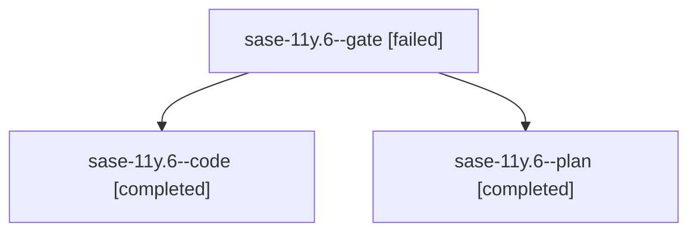

# Family: sase-11y.6

[Agent Hoods](../README.md) / [bbugyi200](../users/bbugyi200/README.md) / [athena](../users/bbugyi200/machines/athena/README.md) / [sase-11y](../users/bbugyi200/machines/athena/hoods/sase-11y/README.md) / sase-11y.6

Owner: `bbugyi200.athena` · Hood: `sase-11y` · Members: 3 · Bead: [sase-11y.6](https://github.com/sase-org/sase--beads/blob/main/pages/sase-11y/sase-11y.6.md)

## Lineage

The diagram is an optional enhancement; the ordered table below contains the same lineage in accessible text.

| Role | Agent | State | Model / provider | Timing | Commits | Prompt | Chat |
|---|---|---|---|---|---:|---|---|
| gate | sase-11y.6--gate | failed | gpt-5.6-sol / codex | 2026-09-18T09:42:56.184018+00:00 → 2026-09-18T09:43:30.766954+00:00 | 0 | — | [Chat](../agents/bbugyi200.athena.sase-11y.6--gate/chat.md) |
| code | sase-11y.6--code | completed | gpt-5.5 / codex | 2026-09-18T09:43:41.449704+00:00 → 2026-09-18T11:55:29.208715+00:00 | [1](../agents/bbugyi200.athena.sase-11y.6--code/README.md#commits) | — | [Chat](../agents/bbugyi200.athena.sase-11y.6--code/chat.md) |
| plan | sase-11y.6--plan | completed | gpt-5.6-sol / codex | 2026-09-18T09:35:21.943782+00:00 → 2026-09-18T11:55:29.208715+00:00 | 0 | [Prompt](../agents/bbugyi200.athena.sase-11y.6--plan/prompt.md) | [Chat](../agents/bbugyi200.athena.sase-11y.6--plan/chat.md) |

## Commits

| Role | Repo | Commit | Subject | Committed |
|---|---|---|---|---|
| code | sase | [`e92e6c9`](https://github.com/sase-org/sase/commit/e92e6c91c1ed4f8ff8d8f83250674d7dd46dbf61) | feat(mobile): move gateway to service host | 2026-09-18 07:49:43 EDT |

## Neighbors

| Agent | Relation | State |
|---|---|---|
| [sase-11y.1](../agents/bbugyi200.athena.sase-11y.1/README.md) | sase-11y hood | completed |
| [sase-11y.10](../agents/bbugyi200.athena.sase-11y.10/README.md) | sase-11y hood | waiting |
| [sase-11y.2](bbugyi200.athena.sase-11y.2.md) (family · 3) | sase-11y hood | failed 3 |
| [sase-11y.2.1.1](../agents/bbugyi200.athena.sase-11y.2.1.1/README.md) | sase-11y hood | active |
| [sase-11y.2.1.2](bbugyi200.athena.sase-11y.2.1.2.md) (family · 5) | sase-11y hood | active 5 |
| [sase-11y.2.1.3](../agents/bbugyi200.athena.sase-11y.2.1.3/README.md) | sase-11y hood | active |
| [sase-11y.2.1.4](../agents/bbugyi200.athena.sase-11y.2.1.4/README.md) | sase-11y hood | active |
| [sase-11y.2.1.5.1](../agents/bbugyi200.athena.sase-11y.2.1.5.1/README.md) | sase-11y hood | active |
| [sase-11y.2.1.5.2](../agents/bbugyi200.athena.sase-11y.2.1.5.2/README.md) | sase-11y hood | active |
| [sase-11y.2.1.5.land](bbugyi200.athena.sase-11y.2.1.5.land.md) (family · 1) | sase-11y hood | active 1 |
| [sase-11y.2.1.land](bbugyi200.athena.sase-11y.2.1.land.md) (family · 3) | sase-11y hood | active 3 |
| [sase-11y.3](bbugyi200.athena.sase-11y.3.md) (family · 7) | sase-11y hood | completed 4, failed 3 |
| [sase-11y.4](bbugyi200.athena.sase-11y.4.md) (family · 3) | sase-11y hood | completed 2, failed 1 |
| [sase-11y.5](bbugyi200.athena.sase-11y.5.md) (family · 3) | sase-11y hood | active 2, failed 1 |
| [sase-11y.7](bbugyi200.athena.sase-11y.7.md) (family · 3) | sase-11y hood | completed 2, failed 1 |
| [sase-11y.8](../agents/bbugyi200.athena.sase-11y.8/README.md) | sase-11y hood | waiting |
| [sase-11y.9](../agents/bbugyi200.athena.sase-11y.9/README.md) | sase-11y hood | waiting |
| [sase-11y.land](../agents/bbugyi200.athena.sase-11y.land/README.md) | sase-11y hood | waiting |
