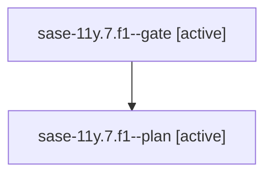

# Family: sase-11y.7.f1

[Agent Hoods](../README.md) / [bbugyi200](../users/bbugyi200/README.md) / [athena](../users/bbugyi200/machines/athena/README.md) / [sase-11y](../users/bbugyi200/machines/athena/hoods/sase-11y/README.md) / sase-11y.7.f1

Owner: `bbugyi200.athena` · Hood: `sase-11y` · Members: 2

## Lineage

The diagram is an optional enhancement; the ordered table below contains the same lineage in accessible text.

| Role | Agent | State | Model / provider | Timing | Commits | Prompt | Chat |
|---|---|---|---|---|---:|---|---|
| gate | sase-11y.7.f1--gate | active | opus / claude | 2026-09-20T13:37:33.122308+00:00 | 0 | — | — |
| plan | sase-11y.7.f1--plan | active | opus / claude | 2026-09-20T13:00:08.475083+00:00 | 0 | [Prompt](../agents/bbugyi200.athena.sase-11y.7.f1--plan/prompt.md) | [Chat](../agents/bbugyi200.athena.sase-11y.7.f1--plan/chat.md) |

## Neighbors

| Agent | Relation | State |
|---|---|---|
| [sase-11y.7](bbugyi200.athena.sase-11y.7.md) (family · 12) | ancestor | active 1, completed 6, failed 5 |
| [sase-11y.7.f0](../agents/bbugyi200.athena.sase-11y.7.f0/README.md) | sase-11y.7 hood | active |
| [sase-11y.1](../agents/bbugyi200.athena.sase-11y.1/README.md) | sase-11y hood | completed |
| [sase-11y.10](bbugyi200.athena.sase-11y.10.md) (family · 3) | sase-11y hood | failed 3 |
| [sase-11y.10.1.1](../agents/bbugyi200.athena.sase-11y.10.1.1/README.md) | sase-11y hood | completed |
| [sase-11y.10.1.2](bbugyi200.athena.sase-11y.10.1.2.md) (family · 3) | sase-11y hood | active 2, failed 1 |
| [sase-11y.10.1.3](../agents/bbugyi200.athena.sase-11y.10.1.3/README.md) | sase-11y hood | waiting |
| [sase-11y.10.1.4](../agents/bbugyi200.athena.sase-11y.10.1.4/README.md) | sase-11y hood | waiting |
| [sase-11y.10.1.5](../agents/bbugyi200.athena.sase-11y.10.1.5/README.md) | sase-11y hood | waiting |
| [sase-11y.10.1.6](../agents/bbugyi200.athena.sase-11y.10.1.6/README.md) | sase-11y hood | waiting |
| [sase-11y.10.1.land](../agents/bbugyi200.athena.sase-11y.10.1.land/README.md) | sase-11y hood | waiting |
| [sase-11y.2](bbugyi200.athena.sase-11y.2.md) (family · 3) | sase-11y hood | failed 3 |
| [sase-11y.2.1.1](../agents/bbugyi200.athena.sase-11y.2.1.1/README.md) | sase-11y hood | active |
| [sase-11y.2.1.2](bbugyi200.athena.sase-11y.2.1.2.md) (family · 5) | sase-11y hood | active 5 |
| [sase-11y.2.1.3](../agents/bbugyi200.athena.sase-11y.2.1.3/README.md) | sase-11y hood | active |
| [sase-11y.2.1.4](../agents/bbugyi200.athena.sase-11y.2.1.4/README.md) | sase-11y hood | active |
| [sase-11y.2.1.5.1](../agents/bbugyi200.athena.sase-11y.2.1.5.1/README.md) | sase-11y hood | active |
| [sase-11y.2.1.5.2](../agents/bbugyi200.athena.sase-11y.2.1.5.2/README.md) | sase-11y hood | active |
| [sase-11y.2.1.5.land](bbugyi200.athena.sase-11y.2.1.5.land.md) (family · 1) | sase-11y hood | active 1 |
| [sase-11y.2.1.land](bbugyi200.athena.sase-11y.2.1.land.md) (family · 3) | sase-11y hood | active 3 |
| [sase-11y.3](bbugyi200.athena.sase-11y.3.md) (family · 7) | sase-11y hood | completed 4, failed 3 |
| [sase-11y.4](bbugyi200.athena.sase-11y.4.md) (family · 3) | sase-11y hood | completed 2, failed 1 |
| [sase-11y.5](bbugyi200.athena.sase-11y.5.md) (family · 7) | sase-11y hood | completed 4, failed 3 |
| [sase-11y.6](bbugyi200.athena.sase-11y.6.md) (family · 3) | sase-11y hood | completed 2, failed 1 |
| [sase-11y.8](../agents/bbugyi200.athena.sase-11y.8/README.md) | sase-11y hood | completed |
| [sase-11y.9](../agents/bbugyi200.athena.sase-11y.9/README.md) | sase-11y hood | completed |
| [sase-11y.land](../agents/bbugyi200.athena.sase-11y.land/README.md) | sase-11y hood | waiting |
