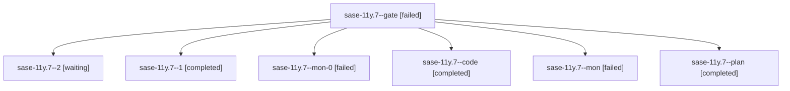

# Family: sase-11y.7

[Agent Hoods](../README.md) / [bbugyi200](../users/bbugyi200/README.md) / [athena](../users/bbugyi200/machines/athena/README.md) / [sase-11y](../users/bbugyi200/machines/athena/hoods/sase-11y/README.md) / sase-11y.7

Owner: `bbugyi200.athena` · Hood: `sase-11y` · Members: 7 · Bead: [sase-11y.7](https://github.com/sase-org/sase--beads/blob/main/pages/sase-11y/sase-11y.7.md)

## Lineage

The diagram is an optional enhancement; the ordered table below contains the same lineage in accessible text.

| Role | Agent | State | Model / provider | Timing | Commits | Prompt | Chat |
|---|---|---|---|---|---:|---|---|
| gate | sase-11y.7--gate | failed | grok-4.6 / grok | 2026-09-19T10:25:04.100781+00:00 → 2026-09-19T10:25:52.752517+00:00 | 0 | — | [Chat](../agents/bbugyi200.athena.sase-11y.7--gate/chat.md) |
| 2 | sase-11y.7--2 | waiting | grok-4.6 / grok | 20260919073829 | 0 | [Prompt](../agents/bbugyi200.athena.sase-11y.7--2/prompt.md) | — |
| 1 | sase-11y.7--1 | completed | grok-4.6 / grok | 2026-09-19T11:03:32.093387+00:00 → 2026-09-19T11:10:25.135463+00:00 | 0 | [Prompt](../agents/bbugyi200.athena.sase-11y.7--1/prompt.md) | [Chat](../agents/bbugyi200.athena.sase-11y.7--1/chat.md) |
| mon-0 | sase-11y.7--mon-0 | failed | grok-4.6 / grok | 2026-09-19T11:08:41.062626+00:00 → 2026-09-19T11:39:31.526902+00:00 | 0 | — | [Chat](../agents/bbugyi200.athena.sase-11y.7--mon-0/chat.md) |
| code | sase-11y.7--code | completed | grok-4.6 / grok | 2026-09-19T10:26:11.307934+00:00 → 2026-09-19T10:57:26.615875+00:00 | 0 | — | [Chat](../agents/bbugyi200.athena.sase-11y.7--code/chat.md) |
| mon | sase-11y.7--mon | failed | grok-4.6 / grok | 2026-09-19T10:56:10.193603+00:00 → 2026-09-19T11:03:18.086508+00:00 | 0 | — | [Chat](../agents/bbugyi200.athena.sase-11y.7--mon/chat.md) |
| plan | sase-11y.7--plan | completed | grok-4.6 / grok | 2026-09-19T10:14:55.740060+00:00 → 2026-09-19T10:57:26.615875+00:00 | 0 | [Prompt](../agents/bbugyi200.athena.sase-11y.7--plan/prompt.md) | [Chat](../agents/bbugyi200.athena.sase-11y.7--plan/chat.md) |

## Commits

| Role | Repo | Commit | Subject | Committed |
|---|---|---|---|---|
| — | sase | [`c2befdb`](https://github.com/sase-org/sase/commit/c2befdbb3e83e6531c61d28af5dacb91f661ce16) | feat(tui): add services tab controls | 2026-09-18 06:59:19 EDT |

## Neighbors

| Agent | Relation | State |
|---|---|---|
| [sase-11y.1](../agents/bbugyi200.athena.sase-11y.1/README.md) | sase-11y hood | completed |
| [sase-11y.10](../agents/bbugyi200.athena.sase-11y.10/README.md) | sase-11y hood | waiting |
| [sase-11y.2](bbugyi200.athena.sase-11y.2.md) (family · 3) | sase-11y hood | failed 3 |
| [sase-11y.2.1.1](../agents/bbugyi200.athena.sase-11y.2.1.1/README.md) | sase-11y hood | active |
| [sase-11y.2.1.2](bbugyi200.athena.sase-11y.2.1.2.md) (family · 5) | sase-11y hood | active 5 |
| [sase-11y.2.1.3](../agents/bbugyi200.athena.sase-11y.2.1.3/README.md) | sase-11y hood | active |
| [sase-11y.2.1.4](../agents/bbugyi200.athena.sase-11y.2.1.4/README.md) | sase-11y hood | active |
| [sase-11y.2.1.5.1](../agents/bbugyi200.athena.sase-11y.2.1.5.1/README.md) | sase-11y hood | active |
| [sase-11y.2.1.5.2](../agents/bbugyi200.athena.sase-11y.2.1.5.2/README.md) | sase-11y hood | active |
| [sase-11y.2.1.5.land](bbugyi200.athena.sase-11y.2.1.5.land.md) (family · 1) | sase-11y hood | active 1 |
| [sase-11y.2.1.land](bbugyi200.athena.sase-11y.2.1.land.md) (family · 3) | sase-11y hood | active 3 |
| [sase-11y.3](bbugyi200.athena.sase-11y.3.md) (family · 7) | sase-11y hood | completed 4, failed 3 |
| [sase-11y.4](bbugyi200.athena.sase-11y.4.md) (family · 3) | sase-11y hood | completed 2, failed 1 |
| [sase-11y.5](bbugyi200.athena.sase-11y.5.md) (family · 4) | sase-11y hood | active 1, completed 2, failed 1 |
| [sase-11y.6](bbugyi200.athena.sase-11y.6.md) (family · 3) | sase-11y hood | completed 2, failed 1 |
| [sase-11y.8](../agents/bbugyi200.athena.sase-11y.8/README.md) | sase-11y hood | waiting |
| [sase-11y.9](../agents/bbugyi200.athena.sase-11y.9/README.md) | sase-11y hood | waiting |
| [sase-11y.land](../agents/bbugyi200.athena.sase-11y.land/README.md) | sase-11y hood | waiting |
