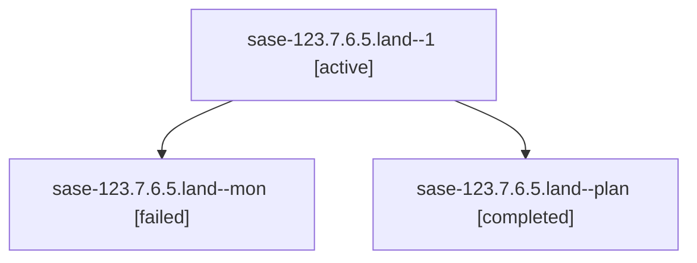

# Family: sase-123.7.6.5.land

[Agent Hoods](../README.md) / [bbugyi200](../users/bbugyi200/README.md) / [athena](../users/bbugyi200/machines/athena/README.md) / [sase-123](../users/bbugyi200/machines/athena/hoods/sase-123/README.md) / sase-123.7.6.5.land

Owner: `bbugyi200.athena` · Hood: `sase-123` · Members: 3 · Bead: [sase-123.7.6.5](https://github.com/sase-org/sase--beads/blob/main/pages/sase-123/sase-123.7.6.5.md)

## Lineage

The diagram is an optional enhancement; the ordered table below contains the same lineage in accessible text.

| Role | Agent | State | Model / provider | Timing | Commits | Prompt | Chat |
|---|---|---|---|---|---:|---|---|
| 1 | sase-123.7.6.5.land--1 | active | gpt-5.6-sol / codex | 2026-09-18T07:24:35.578480+00:00 | 0 | [Prompt](../agents/bbugyi200.athena.sase-123.7.6.5.land--1/prompt.md) | — |
| mon | sase-123.7.6.5.land--mon | failed | gpt-5.6-sol / codex | 2026-09-18T06:48:47.118115+00:00 → 2026-09-18T07:24:31.204421+00:00 | 0 | — | [Chat](../agents/bbugyi200.athena.sase-123.7.6.5.land--mon/chat.md) |
| plan | sase-123.7.6.5.land--plan | completed | gpt-5.6-sol / codex | 2026-09-18T06:29:39.618746+00:00 → 2026-09-18T06:49:16.919731+00:00 | 0 | [Prompt](../agents/bbugyi200.athena.sase-123.7.6.5.land--plan/prompt.md) | [Chat](../agents/bbugyi200.athena.sase-123.7.6.5.land--plan/chat.md) |

## Neighbors

| Agent | Relation | State |
|---|---|---|
| [sase-123.7.6.5.1](../agents/bbugyi200.athena.sase-123.7.6.5.1/README.md) | sase-123.7.6.5 hood | completed |
| [sase-123.7.6.1](../agents/bbugyi200.athena.sase-123.7.6.1/README.md) | sase-123.7.6 hood | completed |
| [sase-123.7.6.2](../agents/bbugyi200.athena.sase-123.7.6.2/README.md) | sase-123.7.6 hood | completed |
| [sase-123.7.6.3](../agents/bbugyi200.athena.sase-123.7.6.3/README.md) | sase-123.7.6 hood | completed |
| [sase-123.7.6.4](../agents/bbugyi200.athena.sase-123.7.6.4/README.md) | sase-123.7.6 hood | completed |
| [sase-123.7.6.land](bbugyi200.athena.sase-123.7.6.land.md) (family · 3) | sase-123.7.6 hood | failed 3 |
| [sase-123.7.1](../agents/bbugyi200.athena.sase-123.7.1/README.md) | sase-123.7 hood | completed |
| [sase-123.7.2](../agents/bbugyi200.athena.sase-123.7.2/README.md) | sase-123.7 hood | completed |
| [sase-123.7.3](../agents/bbugyi200.athena.sase-123.7.3/README.md) | sase-123.7 hood | completed |
| [sase-123.7.4](../agents/bbugyi200.athena.sase-123.7.4/README.md) | sase-123.7 hood | completed |
| [sase-123.7.5](../agents/bbugyi200.athena.sase-123.7.5/README.md) | sase-123.7 hood | completed |
| [sase-123.7.land](bbugyi200.athena.sase-123.7.land.md) (family · 3) | sase-123.7 hood | failed 3 |
| [sase-123.1](../agents/bbugyi200.athena.sase-123.1/README.md) | sase-123 hood | active |
| [sase-123.2](../agents/bbugyi200.athena.sase-123.2/README.md) | sase-123 hood | active |
| [sase-123.3](../agents/bbugyi200.athena.sase-123.3/README.md) | sase-123 hood | completed |
| [sase-123.4](../agents/bbugyi200.athena.sase-123.4/README.md) | sase-123 hood | completed |
| [sase-123.5](../agents/bbugyi200.athena.sase-123.5/README.md) | sase-123 hood | active |
| [sase-123.6](../agents/bbugyi200.athena.sase-123.6/README.md) | sase-123 hood | completed |
| [sase-123.land](bbugyi200.athena.sase-123.land.md) (family · 3) | sase-123 hood | failed 3 |
